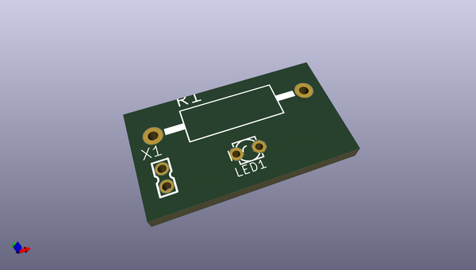

# OOMP Project  
## open-source-hardware-repo-example  by Drc3p0  
  
oomp key: oomp_projects_flat_drc3p0_open_source_hardware_repo_example  
(snippet of original readme)  
  
Open Hardware Project Template  
=======================================================  
  
This repository serves as an example template to help you create great documentation for your Open Hardware projects.  It contains examples of the recommended files and filestructure that is commonly shared in open source hardware projects. Sharing all of these resources is optional, so please fill out everything you can, and delete the files you aren't using.   
  
You can use this template and replace all of the files/text with your own documents.    
Here are a few examples of great documentation.    
  
- [Pixie Chroma open source documentation](https://github.com/connornishijima/Pixie_Chroma)    
- [Slime VR how-to documentation](https://docs.slimevr.dev/)    
- [MNT Reform open source documentation](https://source.mnt.re/reform/reform)    
  
  
The proposed structure of folders within this template is based on the 'Best Practices for Open-Source Hardware' document published by the Open Source Hardware Association.  
http://www.oshwa.org/sharing-best-practices/  
  
  
You are free to modify this document as it best suits your needs, by overwriting the text on each paragraph and adding/deleting any information or extra files that you consider useful.  
  
You can start by deleting this section, including this line of text.  
  
  
Name of Your Project  
=====================  
Include a link and any relevant info about where to purchase your product.   
  
Write here a short description (two or three paragraphs long) on which yo  
  full source readme at [readme_src.md](readme_src.md)  
  
source repo at: [https://github.com/Drc3p0/open-source-hardware-repo-example](https://github.com/Drc3p0/open-source-hardware-repo-example)  
## Board  
  
  
## Schematic  
  
  
  
[schematic pdf](working_schematic.pdf)  
## Images  
