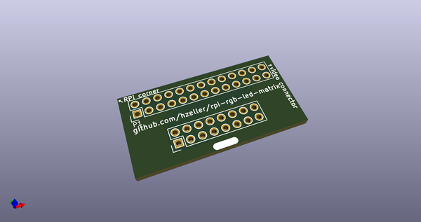
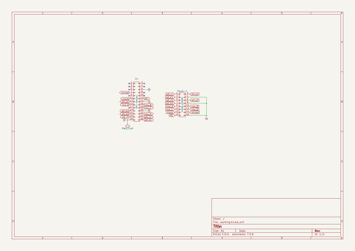
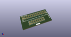
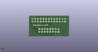
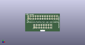

# OOMP Project  
## rpi-rgb-led-matrix  by Drc3p0  
  
oomp key: oomp_projects_flat_drc3p0_rpi_rgb_led_matrix  
(snippet of original readme)  
  
Controlling RGB LED display with Raspberry Pi GPIO  
==================================================  
  
A library to control commonly available 32x32 or 16x32 RGB LED panels with the  
Raspberry Pi. Can support PWM up to 11Bit per channel, providing true 24bpp  
color with CIE1931 profile.  
  
Supports 3 chains with many 32x32-panels each.  
On a Raspberry Pi 2, you can easily chain 12 panels in that chain (so 36 panels total),  
but you can stretch that to up to 96-ish panels (32 chain length) and still reach  
around 100Hz refresh rate with full 24Bit color (theoretical - never tested this;  
there might likely be timing problems with the panels that will creep up then).  
With fewer colors you can control even more, faster.  
  
The LED-matrix library is (c) Henner Zeller <h.zeller@acm.org>, licensed with  
[GNU General Public License Version 2.0](http://www.gnu.org/licenses/gpl-2.0.txt)  
(which means, if you use it in a product somewhere, you need to make the  
source and all your modifications available to the receiver of such product so  
that they have the freedom to adapt and improve).  
  
Note to Old Time Users: Several changes in defines and flags  
------------------------------------------------------------  
If you have checked out this library before, you might find that some  
files are re-organized in different directories (e.g. there is now a separation  
for library examples and utilities), and that the flags to binaries are now  
long and unified. Also, for the most part, you don't need to tweak pa  
  full source readme at [readme_src.md](readme_src.md)  
  
source repo at: [https://github.com/Drc3p0/rpi-rgb-led-matrix](https://github.com/Drc3p0/rpi-rgb-led-matrix)  
## Board  
  
  
## Schematic  
  
  
  
[schematic pdf](working_schematic.pdf)  
## Images  
  
  
  
  
  
  
