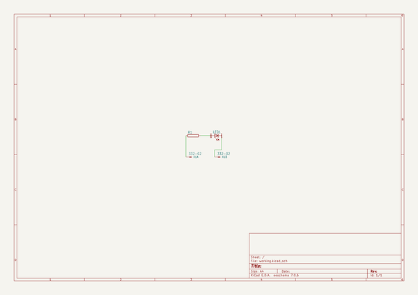

# OOMP Project  
## simplified-open-source-hardware-template-for-GitHub-Pages  by Drc3p0  
  
(snippet of original readme)  
  
Open Hardware Project Template  
=======================================================  
This repo serves as a template/demonstration for using GitHub Pages to build your custom site.  You can learn more about GitHub Pages through the [GitHub Pages user guides](https://docs.github.com/en/pages).   
  
See this page rendered as a [GitHub page](https://drc3p0.github.io/simplified-open-source-hardware-template-for-GitHub-Pages/).   
  
*ToDo: implement Jekyll theme and format all files for Page layout. [https://docs.github.com/en/pages/setting-up-a-github-pages-site-with-jekyll/adding-a-theme-to-your-github-pages-site-using-jekyll](https://docs.github.com/en/pages/setting-up-a-github-pages-site-with-jekyll/adding-a-theme-to-your-github-pages-site-using-jekyll)   
  
This repository serves as an example template to help you create great documentation for your Open Hardware projects by using GitHub Pages.  It contains examples of the recommended files and filestructure that is commonly shared in open source hardware projects. Sharing all of these resources is optional, so please fill out everything you can, and delete the files you aren't using.   
  
You can use this template and replace all of the files/text with your own documents.    
Here are a few examples of great GitHub Pages.    
  
- [Pixie Chroma open source documentation](https://github.com/connornishijima/Pixie_Chroma)    
- [Slime VR how-to documentation](https://docs.slimevr.dev/)    
- [MNT Reform open source documentation](https://source.mnt  
  full source readme at [readme_src.md](readme_src.md)  
  
source repo at: [https://github.com/Drc3p0/simplified-open-source-hardware-template-for-GitHub-Pages](https://github.com/Drc3p0/simplified-open-source-hardware-template-for-GitHub-Pages)  
## Board  
  
  
## Schematic  
  
  
  
[schematic pdf](working_schematic.pdf)  
## Images  
