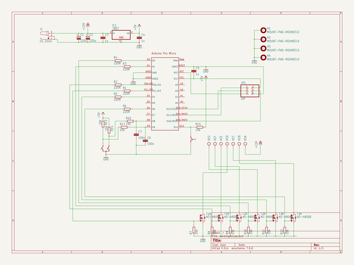

# OOMP Project  
## AVR-RGBWA-Controller  by ebastler  
  
oomp key: oomp_projects_flat_ebastler_avr_rgbwa_controller  
(snippet of original readme)  
  
-- AVR RGBWA Controller  
--- Overview  
This project was born as an ambient light for a living room. I wanted five controllable LED channels and compatibility with 12 V or 24 V LED stripes and an easy to use interface with a single rotary encoder (and it's push button). As a controller I chose an "Arduino pro Micro" from China, because I wanted to be able to add USB support later on and the arduino features an ATmega32U4 with all necessary external components. It was, however, programmed entirely in C without any Arduino-headers or library.  
  
--- Schematic and Layout  
I tried to only use cheap and easily available standard components, all of which should be available at my usual component shop, Reichelt.de.  
While the Layout was made using almost entirely SMD components, all footprints are large enough to be easily soldered by hand without SMD soldering experience or expensive equipment.  
The double sided layout itself needed a fair amount of VIAs, but it should be possible to manufacture it at home with a bit of experience in making PCBs.  
  
Eagle files, Gerber Files and pdf layouts, as well as pngs of both layers and the schematic can be found in the PCB folder.  
  
The Arduino can be directly soldered onto the PCB using pin headers and programmed with a 6pin ISP port  
  
--- Code  
The code is written in plain C, without relying on any non-standard libraries. I have written and compiled it with the most recent version of Atmel Studio, which handles most standard library includes and compil  
  full source readme at [readme_src.md](readme_src.md)  
  
source repo at: [https://github.com/ebastler/AVR-RGBWA-Controller](https://github.com/ebastler/AVR-RGBWA-Controller)  
## Board  
  
  
## Schematic  
  
  
  
[schematic pdf](working_schematic.pdf)  
## Images  
