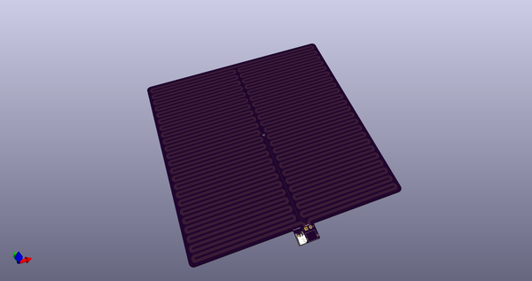
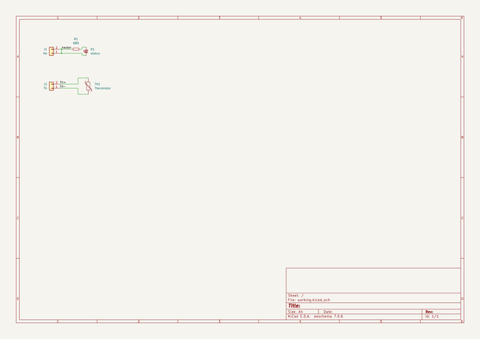
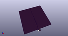
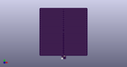

# OOMP Project  
## e3pb  by ebastler  
  
oomp key: oomp_projects_flat_ebastler_e3pb  
(snippet of original readme)  
  
- Ender 3 (Pro) Printbed  
  
This is an attempt of uniting print surface and heating element into a single PCB. Both heating traces and temperature sensing are located on the bottom of the PCB, while the top surface is exposed FR4 (no copper, no soldermask).   
  
A LED on top indicates when the heatbed is being active. Temperature sensing uses a JST XH 2-pin connector, while the heating wires can either be directly soldered, or connected with a Amass XT30U connector. Target operating voltage/power: 24V 240W.  
  
This is a WIP and shouldn't be used just yet - I am still waiting for my Ender 3 Pro to arrive to finalize the design and order protos.  
  full source readme at [readme_src.md](readme_src.md)  
  
source repo at: [https://github.com/ebastler/e3pb](https://github.com/ebastler/e3pb)  
## Board  
  
  
## Schematic  
  
  
  
[schematic pdf](working_schematic.pdf)  
## Images  
  
  
  
  
  
  
