# OOMP Project  
## E80-1800  by ebastler  
  
(snippet of original readme)  
  
- E80-1800  
QMK compatible USB-C PCB for a Cherry G80-1800  
  
The board has been prototyped and works as intended, while fitting most G80-1800 housings. Rev 1.1 and later should fix all tolerance issues, and fit all G80-1800 (and as far as I know also G81-1800) enclosures. I can, however, not guarantee perfect operation of the PCB or compatibility with every enclosure variation - if you encounter any issues, please let me know. Rev 1.2 has not yet been tested, but changes were minimal - no issues are to be expected. Stock situations as well as component rotations at JLC may change over time and hence I can not guarantee for the BOM/CPL files to work perfectly. Please double-check before ordering!  
  
|||  
|:----------------------------------------:|:----------------------------------------:|  
  
-- Order information at JLCPCB  
All relevant files can be found in `E80-1800-pcb-universal\jlcpcb`. The `gerber` subfolder contains a .zip file, the `assembly` subfolder contains the BOM and POS/CPL files needed for assembly. Please double-check all component values and rotations before ordering!  
  
* [gerber](E80-1800-pcb-universal/jlcpcb/gerber/GERBER-E80-1800-pcb-universal.zip)  
* [BOM](E80-1800-pcb-universal/jlcpcb/assembly/BOM-E80-1800-pcb-universal.csv)  
* [POS](E80-1800-pcb-universal/jlcpcb/assembly/POS-E80-1800-pcb-universal.csv)  
  
Since jlcpcb usually fails to auto-determine the PCB dimensions: `382 x 160 mm` is the correct size.  
  
Consider   
  full source readme at [readme_src.md](readme_src.md)  
  
source repo at: [https://github.com/ebastler/E80-1800](https://github.com/ebastler/E80-1800)  
## Board  
  
[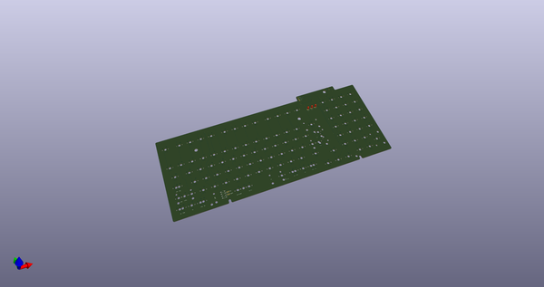](working_3d.png)  
## Schematic  
  
[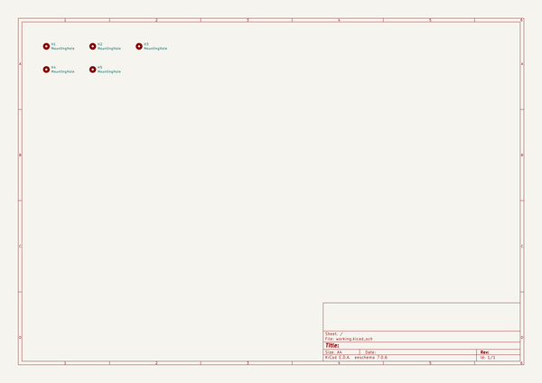](working_schematic.png)  
  
[schematic pdf](working_schematic.pdf)  
## Images  
  
[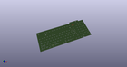](working_3d.png)  
  
[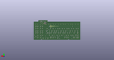](working_3d_back.png)  
  
  
  
[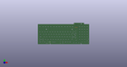](working_3d_front.png)  
  
  
  
[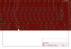](working_assembly_page_01.png)  
  
[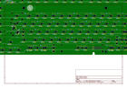](working_assembly_page_02.png)  
  
[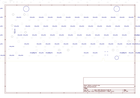](working_assembly_page_03.png)  
  
[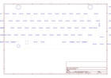](working_assembly_page_04.png)  
  
[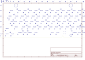](working_assembly_page_05.png)  
  
[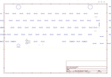](working_assembly_page_06.png)  
