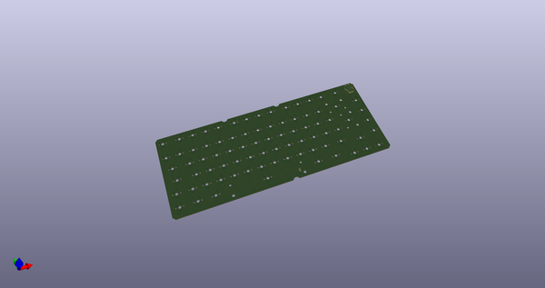
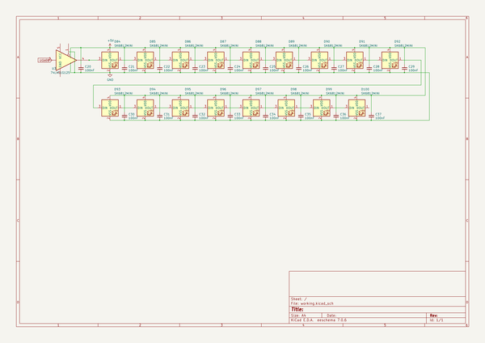
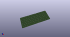
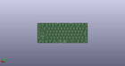
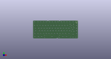

# OOMP Project  
## isometria-75  by ebastler  
  
oomp key: oomp_projects_flat_ebastler_isometria_75  
(snippet of original readme)  
  
- isometria75  
  
The first prototype is sitting on my desk and works perfectly - clearance for weights and battery is currently wrong, so the intended battery will not fit in the case.  
  
----  
   
 The name isometria75 has it's origin in the greek noun ἰσομετρία (in latin letters: isometria), meaning "equality of measure" [[1]](http://perseus.uchicago.edu/cgi-bin/philologic/getobject.pl?c.35:6:59.LSJ). This word ended up being included in various languages, among them english (isometric), with the same meaning. I chose it for two reasons - because this keyboard is only available in an ISO layout (sorry ANSI users - for once it is ne ANSI avail), but also, because I paid attention to only use u/4 spaces throughout my board. You will have a hard time finding any distance on it that's not a multiple of 4.75 mm.  
  
|||  
|:----------------------------------------:|:----------------------------------------:|  
|||  
|||  
  
  
 -- Features  
 * CNC'd top shell with integrated 3 mm plate (obviously, with cutouts for switch retention and PCB mount stabs)  
 * 6.8° typing angle  
 * The PC  
  full source readme at [readme_src.md](readme_src.md)  
  
source repo at: [https://github.com/ebastler/isometria-75](https://github.com/ebastler/isometria-75)  
## Board  
  
  
## Schematic  
  
  
  
[schematic pdf](working_schematic.pdf)  
## Images  
  
  
  
  
  
  
