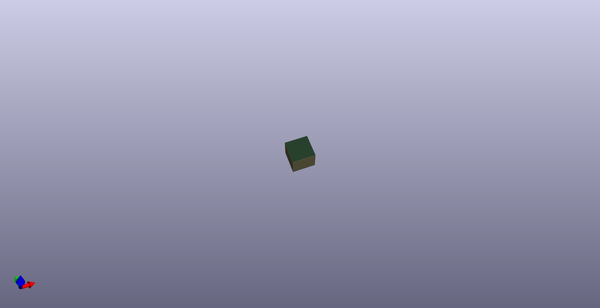

# OOMP Project  
## marbastlib  by ebastler  
  
(snippet of original readme)  
  
- marbastlib  
A library collecting MX and Choc style footprints, as well as various other parts used to design custom keyboards. It is maintained by [ebastler](https://github.com/ebastler/) and [MarvFPV](https://github.com/marvfpv). It is made in/for KiCAD 7.0 stable version. Older versions are no longer supported by the main branch, please refer to one of the v6 branches for KiCAD 6.x, and my (significantly smaller) [legacy lib](https://github.com/ebastler/KiCAD-keyboard-parts.pretty) for KiCAD 5.x.  
  
We try to offer 3D models for as many footprints in this library as possible, creating our own models where none exist. All components for which we have models available have them linked into the footprint - the PCM version will automatically download everything in the right file paths.  
  
-- How to install  
Open the KiCAD "Plugin and Content Manager" (referred to as "PCM" from now on) and click on "Manage". Add a new entry with the plus sign and paste   
  
```  
https://raw.githubusercontent.com/ebastler/ebastler-KiCAD-repository/main/repository.json  
```  
  
From this point on you will have "ebastler KiCAD repository" in your drop-down selection, and it will allow you to install (and update) marbastlib through PCM - easy and hassle-free.  
  
  
  
--- **We do not assume any responsibility for broken PCBs or damages derived from errors in this library. Use at your own risk, and please open an issue or pull-request if you encounter any errors.**  
  
  
-- Symbol Libs  
-  
  full source readme at [readme_src.md](readme_src.md)  
  
source repo at: [https://github.com/ebastler/marbastlib](https://github.com/ebastler/marbastlib)  
## Board  
  
[](working_3d.png)  
## Schematic  
  
[](working_schematic.png)  
  
[schematic pdf](working_schematic.pdf)  
## Images  
  
[](working_3d.png)  
  
[](working_3d_back.png)  
  
[](working_3D_bottom.png)  
  
[](working_3d_front.png)  
  
[](working_3D_top.png)  
  
[](working_assembly_page_01.png)  
  
[](working_assembly_page_02.png)  
  
[](working_assembly_page_03.png)  
  
[](working_assembly_page_04.png)  
  
[](working_assembly_page_05.png)  
  
[](working_assembly_page_06.png)  
