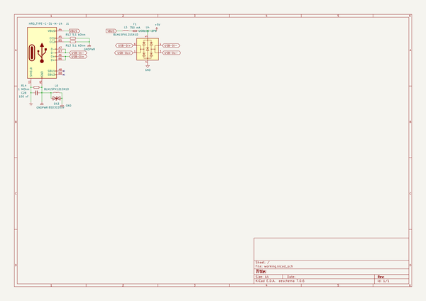

# OOMP Project  
## osprey  by ebastler  
  
(snippet of original readme)  
  
- Osprey  
  
The Osprey is a column staggered 40% wireless ergonomic keyboard. PCB and 3D-printable case are both open source (CERN OHL Permissive), and so is the software (MIT) as it is designed to run the [ZMK firmware](https://github.com/zmkfirmware/zmk).  
  
       
  
The board was designed to be an elegant and sleek unibody keyboard, without sacrificing typing comfort or portability. While the enclosure has raised edges to hide the keyswitches for a more refined look, it is still as slim as possible with Choc v1 switches, leading to a total thickness of about 16 mm from bottom to keycap top, if used with MBK keycaps.  
  
The PCB is "floating" inside the case and the switches are held in-place by a 1.2 mm FR4 plate, which is sandwiched between case top and bottom half.  
  
-- Hardware  
The Rev A is the first board in the Osprey family, using an nRF52840 chip, running in full DC-DC mode for highest possible battery life. A Texas Instruments BQ24075 battery management chip ensures reliable charging, while a MAX17048 fuel gauge allows for accurate battery status measurements which are communicated to your PC via Bluetooth.  
  
The PCB is designed for Kailh Choc v1, which can be hot-swapped, and does not need any stabilizers - the largest key is 1.5u f  
  full source readme at [readme_src.md](readme_src.md)  
  
source repo at: [https://github.com/ebastler/osprey](https://github.com/ebastler/osprey)  
## Board  
  
  
## Schematic  
  
  
  
[schematic pdf](working_schematic.pdf)  
## Images  
  
  
  
  
  
  
  
  
  
  
  
  
  
  
  
  
  
  
  
  
  
  
