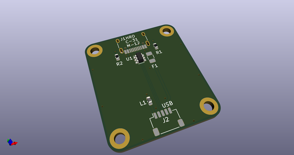
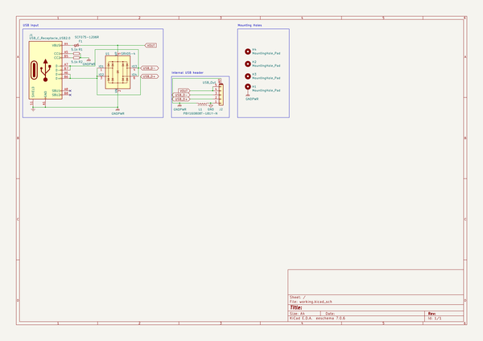
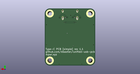
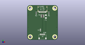

# OOMP Project  
## unified-usb-pcb  by ebastler  
  
(snippet of original readme)  
  
- Unified USB type-C PCB  
  
-- Changelog  
* 22.11.2020: Simple PCB works, battery PCB is broken. Schematic has been fixed, PCB not. Fix will follow once I find time.  
* 09.11.2022: Battery PCB should be fixed, but is untested - I applied the same modifications I previously bodge-wired to earlier protos. The simple PCB now also outputs 5V on the VBUS sense pin, allowing the ZMK Isometria to work with it. I also re-created production files since jlcpcb capabilities increased and they can now assemble everything on these boards. The project is mostly considered abandoned, as I moved to including all battery related circuitry on the main keyboard PCB by now. Still wanted to fix this old project of mine.  
  
A collection of compatible USB-C (2.0) daughterboards with different capabilities, intended to be used in custom mechanical keyboards. All feature the same mechanical dimensions and mounting holes, as well as the same connector leading to the main keyboard PCB and can therefore be exchanged depending on the requeirements.  
  
|||  
|:----------------------------------------:|:----------------------------------------:|  
|Simple PCB |Battery PCB|  
  
--- [Plain USB PCB](unified-usb-pcb_simple)  
The simplest and cheapest of the three is just a plain USB breakout board, connecting a USB type C receptacle to a JST SH header for the main keyboard.  
 * USB type C  
 *  
  full source readme at [readme_src.md](readme_src.md)  
  
source repo at: [https://github.com/ebastler/unified-usb-pcb](https://github.com/ebastler/unified-usb-pcb)  
## Board  
  
  
## Schematic  
  
  
  
[schematic pdf](working_schematic.pdf)  
## Images  
  
  
  
  
  
  
