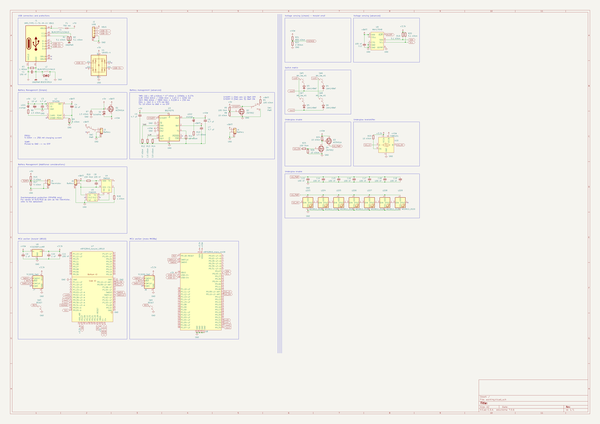

# OOMP Project  
## zmk-designguide  by ebastler  
  
(snippet of original readme)  
  
-- Please note: This guide in its latest revision has just been published and may contain spelling mistakes as well as explanations referring to wrong components due to being written at an earlier stage, before re-annotation of the schematic. Please report any possible erorrs.  
  
-- Introduction  
  
Since it's launch a few years ago, [ZMK](https://zmkfirmware.dev/), an open source firmware for (mainly wireless) custom keyboards, has grown in both features and userbase rapidly and I have recently designed multiple boards making use of it in the past. Questions about how to design ZMK compatible hardware have been getting more common, and the first edition of my guide was a crude attempt at answering those. The third revision - which is only the second revision of the guide, but based on the third generation of wireless designs I made - is a more advanced and refined approach. It still contains all Rev 1 circuitry, but with small improvements, and multiple more "advanced" alternative schematic snippets, as well as better explanations and descriptions.  
  
Most keyboard design guides focus heavily on QMK (and QMK compatible MCUs). While ZMK works flawlessly on STM32 (e.G STM32F303) and PCBs for those can be designed the same way as QMK compatible PCBs would be, the main appeal of ZMK is wireless operation, and I will focus on a nRF52840 based design in this guide. Keep in mind, this is no official ZMK team related guide - just a reference implementation from a user, for users. If you no  
  full source readme at [readme_src.md](readme_src.md)  
  
source repo at: [https://github.com/ebastler/zmk-designguide](https://github.com/ebastler/zmk-designguide)  
## Board  
  
  
## Schematic  
  
  
  
[schematic pdf](working_schematic.pdf)  
## Images  
  
  
  
  
  
  
  
  
  
  
  
  
  
  
  
  
  
  
  
  
  
  
