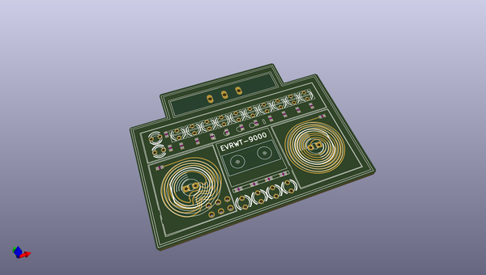

# OOMP Project  
## disaster01  by electrolama  
  
oomp key: oomp_projects_flat_electrolama_disaster01  
(snippet of original readme)  
  
- disaster01  
overly blinky thing debuted at Hackaday Supercon 2019  
  
Details at [electrolama.com/p/disaster01](https://electrolama.com/p/disaster01/).  
  
  full source readme at [readme_src.md](readme_src.md)  
  
source repo at: [https://github.com/electrolama/disaster01](https://github.com/electrolama/disaster01)  
## Board  
  
  
## Schematic  
  
  
  
[schematic pdf](working_schematic.pdf)  
## Images  
