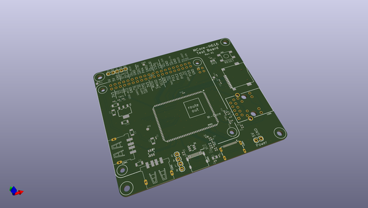

# OOMP Project  
## mcore-h616-breakout  by electrolama  
  
oomp key: oomp_projects_flat_electrolama_mcore_h616_breakout  
(snippet of original readme)  
  
- mcore-h616-breakout  
  
  
  
A breakout for the [Mango Pi MCore-H616](https://mangopi.org/mcoreh616) module.  
  full source readme at [readme_src.md](readme_src.md)  
  
source repo at: [https://github.com/electrolama/mcore-h616-breakout](https://github.com/electrolama/mcore-h616-breakout)  
## Board  
  
  
## Schematic  
  
  
  
[schematic pdf](working_schematic.pdf)  
## Images  
