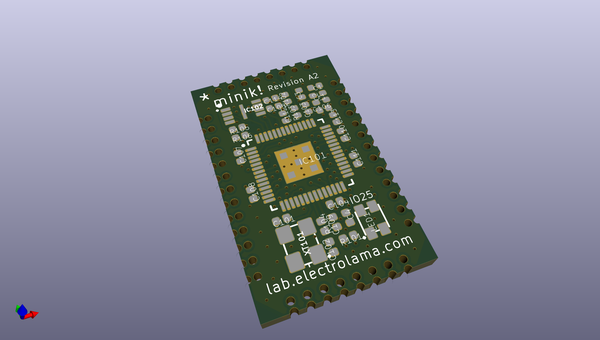
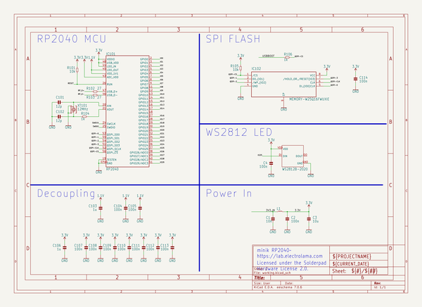
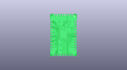
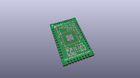
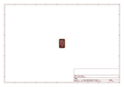
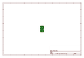
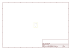
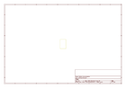
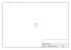

# OOMP Project  
## minik  by electrolama  
  
(snippet of original readme)  
  
- minik  
  
A tiny RP2040 module for small embedded things!  
  
minik is designed by Electrolama / @omerk and licensed under the Solderpad Hardware License 2.0.  
  
  
-- Status  
  
module design files are already in this repo, breakout and libraries to follow. [Here's a preview](https://twitter.com/OmerK/status/1535297431444791298) of what the module and breakout looks like.  
  
  
-- CircuitPython support  
  
minik is supported by CircuitPython! Grab the latest builds [here](https://adafruit-circuit-python.s3.amazonaws.com/index.html?prefix=bin/electrolama_minik).  
  full source readme at [readme_src.md](readme_src.md)  
  
source repo at: [https://github.com/electrolama/minik](https://github.com/electrolama/minik)  
## Board  
  
  
## Schematic  
  
  
  
[schematic pdf](working_schematic.pdf)  
## Images  
  
  
  
  
  
  
  
  
  
  
  
  
  
  
  
  
