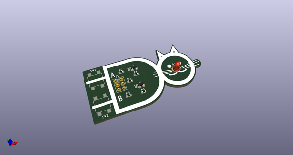
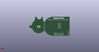

# OOMP Project  
## nandcat  by electrolama  
  
oomp key: oomp_projects_flat_electrolama_nandcat  
(snippet of original readme)  
  
- nandcat  
  
Frivolous logic gate demonstrator / [SAO](https://hackaday.com/2019/03/20/introducing-the-shitty-add-on-v1-69bis-standard/) compatible fashion statement.  
  
Details at [electrolama.com/p/nandcat](https://electrolama.com/p/nandcat/).  
  
  full source readme at [readme_src.md](readme_src.md)  
  
source repo at: [https://github.com/electrolama/nandcat](https://github.com/electrolama/nandcat)  
## Board  
  
  
## Schematic  
  
  
  
[schematic pdf](working_schematic.pdf)  
## Images  
  
  
  
  
  
  
