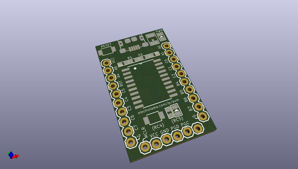
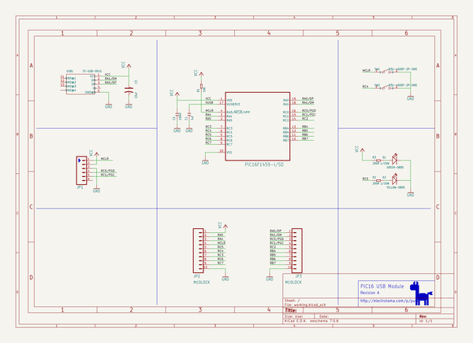

# OOMP Project  
## pic16-usb-module  by electrolama  
  
oomp key: oomp_projects_flat_electrolama_pic16_usb_module  
(snippet of original readme)  
  
- pic16-usb-module  
  full source readme at [readme_src.md](readme_src.md)  
  
source repo at: [https://github.com/electrolama/pic16-usb-module](https://github.com/electrolama/pic16-usb-module)  
## Board  
  
  
## Schematic  
  
  
  
[schematic pdf](working_schematic.pdf)  
## Images  
