# OOMP Project  
## TinyReflowController  by electrolama  
  
(snippet of original readme)  
  
- Tiny Reflow Controller  
An all-in-one Arduino compatible reflow controller powered by ATmega328P (V2) or ATtiny1634R (V1). A reincarnation of the Reflow Oven Controller Shield that requires an external Arduino board like Arduino Uno based on user feedbacks over the years. Powered by the ATmega328P/ATtiny1634R coupled with the latest thermocouple sensor interface IC MAX31856 from Maxim, we managed to remove the need of an Arduino board and reduce the overall cost. We also use as much SMD parts in this revision to keep the cost low (manual soldering and left over residue cleaning is time consuming) and leaving only the terminal block and the LCD connector on through hole version. We also managed to streamline all components to run on 3.3V to further simplify the design. All you need is an external Solid State Relay (SSR) (rated accordingly to your oven), K type thermocouple (we recommend those with fiber glass or steel jacket), and an oven of course! You can now select to run a lead-free profile or leaded profile from the selection switch. V2 comes with 0.96" 128*64 OLED LCD to plot the real-time reflow curve and has a built-in serial-USB interface. V2 also has an optional transistor output drive fan if needed.   
  
-- Fork Notes  
  
I've modified the hardware to be mounted inside a box, keeping the same board size -- essentially just adding headers for buttons with a few more tweaks.  
  
--- Hardware  
  
Changes in Rev A1 (based on "2v00 12-2018"):  
  
  - Import/clean-up for Kicad 6  
  - Re  
  full source readme at [readme_src.md](readme_src.md)  
  
source repo at: [https://github.com/electrolama/TinyReflowController](https://github.com/electrolama/TinyReflowController)  
## Board  
  
  
## Schematic  
  
[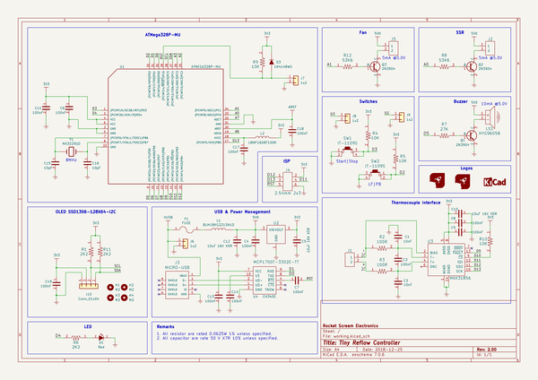](working_schematic.png)  
  
[schematic pdf](working_schematic.pdf)  
## Images  
  
[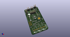](working_3d.png)  
  
[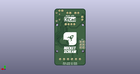](working_3d_back.png)  
  
[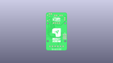](working_3D_bottom.png)  
  
[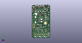](working_3d_front.png)  
  
[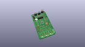](working_3D_top.png)  
  
[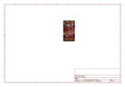](working_assembly_page_01.png)  
  
[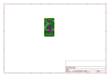](working_assembly_page_02.png)  
  
[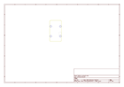](working_assembly_page_03.png)  
  
[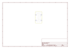](working_assembly_page_04.png)  
  
[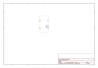](working_assembly_page_05.png)  
  
[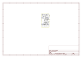](working_assembly_page_06.png)  
