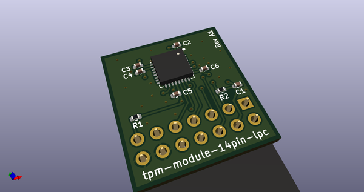
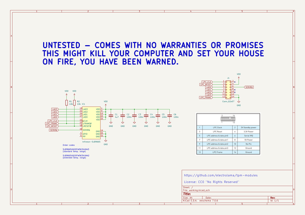
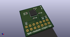
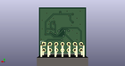
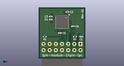

# OOMP Project  
## tpm-modules  by electrolama  
  
oomp key: oomp_projects_flat_electrolama_tpm_modules  
(snippet of original readme)  
  
- tpm-modules  
  
KiCAD (v5.99) designs for Infineon SLB9665 and SLB9670 based TPM modules.  
  
There are two interfaces: SPI (SLB9670) and LPC (SLB9665). Pinouts for the modules vary a lot ([manufacturer specific?](https://superuser.com/a/1537838)) but given how simple the boards are adding new ones should be fairly straightforward.   
  
Modules in this repo:  
  
**tpm-module-12pin-spi**  
  
  
  
`Status:` Untested, parts ordered for prototypes  
  
**tpm-module-14pin-lpc**  
  
  
  
`Status:` Untested, please raise a PR if you build and test one.  
  
If you do end up designing a new module, raise a PR so we can collect them all in one repo.  
  
**UNTESTED DESIGNS - COMES WITH NO WARRANTIES OR PROMISES**  
  
THIS MIGHT KILL YOUR COMPUTER AND SET YOUR HOUSE ON FIRE.  
  
YOU HAVE BEEN WARNED.  
  
**License:** CC0 "No Rights Reserved"  
  full source readme at [readme_src.md](readme_src.md)  
  
source repo at: [https://github.com/electrolama/tpm-modules](https://github.com/electrolama/tpm-modules)  
## Board  
  
  
## Schematic  
  
  
  
[schematic pdf](working_schematic.pdf)  
## Images  
  
  
  
  
  
  
