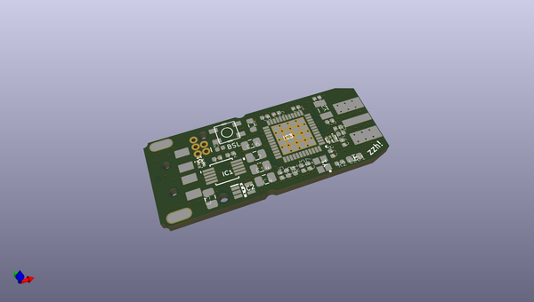
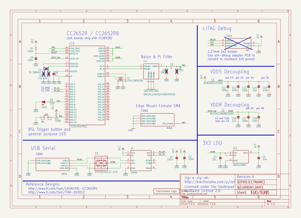
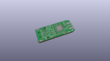
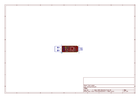
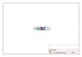
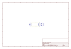
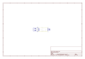
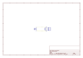
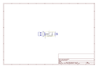

# OOMP Project  
## zig-a-zig-ah  by electrolama  
  
oomp key: oomp_projects_flat_electrolama_zig_a_zig_ah  
(snippet of original readme)  
  
- zig-a-zig-ah  
  
zig-a-zig-ah! (zzh, for short) is little USB-stick form factor dev board for multiprotocol RF tinkering. It utilises the TI CC2652R multi-standard wireless MCU and a USB-UART chip with a few more goodies.  
  
Details at [electrolama.com/p/zzh](https://electrolama.com/projects/zig-a-zig-ah/).  
  
Pre-assembled boards for sale [on our Tindie store](https://www.tindie.com/stores/electrolama/).  
  
**Need help with your Tindie purchase?** Please send an email to support@electrolama.com. Github issues are not the right place for customer support and we do not monitor them.  
  
zzh is designed by Electrolama / Omer Kilic and licensed under the [Solderpad Hardware License 2.0](https://solderpad.org/licenses/SHL-2.0/).   
  
  full source readme at [readme_src.md](readme_src.md)  
  
source repo at: [https://github.com/electrolama/zig-a-zig-ah](https://github.com/electrolama/zig-a-zig-ah)  
## Board  
  
  
## Schematic  
  
  
  
[schematic pdf](working_schematic.pdf)  
## Images  
  
  
  
  
  
  
  
  
  
  
  
  
  
  
  
  
