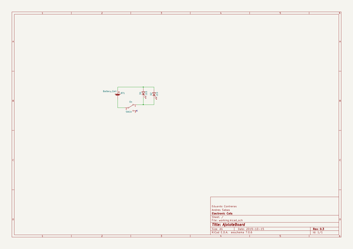
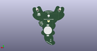
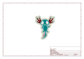
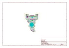
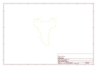
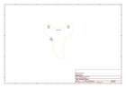
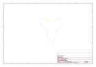

# OOMP Project  
## AjoloteBoard  by ElectronicCats  
  
(snippet of original readme)  
  
View this project on [CADLAB.io](https://cadlab.io/project/1720).   
  
- Ajolote Board Kit  
  
  
  
Las insignias de ajolote son insoportablemente lindas. Creadas especialmente para enseñar a cualquier persona a soldar su primer tarjeta electrónica; es un kit de soldadura muy básico y adecuado para todas las edades.  
  
¡Este kit de Ajolote tiene dos LED de colores con patrones de luz diferentes! El interruptor te permite encender o apagar el dispositivo y un holder de batería.  
  
Una vez que el kit de insignia está soldado y la batería insertada, el LED de la insignia parpadea y cambia de color durante aproximadamente 24 horas. Puedes usarlo como un pin en tu ropa, un collar, de llavero o en una pulsera  
Se requieren habilidades de soldadura muy básicas.  
  
Por amor a los ajolotes, conciencia de su preservación y orgulloso patrimonio mexicano, nos hemos unido a la Asociación Civil [“Redes y Restauración Ecologica”](http://www.redesmx.org/) , destinando el 50% de las ganancias del kit y sea utilizado para ayuda del ajolote y su hábitad natural, así como la concientización que representa su conservación.  
  
--- [Disponible en nuestra tienda](https://electroniccats.com/producto/pre-order-ajolote-board-kit/)  
  
-- Licence  
  
  
  
Hardware r  
  full source readme at [readme_src.md](readme_src.md)  
  
source repo at: [https://github.com/ElectronicCats/AjoloteBoard](https://github.com/ElectronicCats/AjoloteBoard)  
## Board  
  
  
## Schematic  
  
  
  
[schematic pdf](working_schematic.pdf)  
## Images  
  
  
  
  
  
  
  
  
  
  
  
  
  
  
  
  
  
  
  
  
  
  
