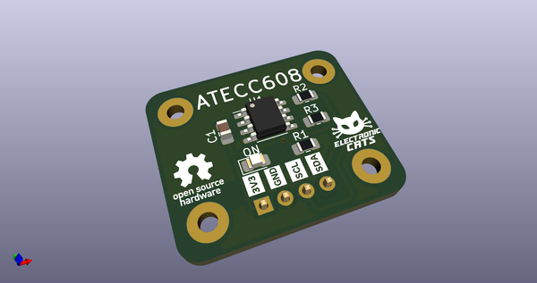

# OOMP Project  
## ATECC608A-Croquette  by ElectronicCats  
  
(snippet of original readme)  
  
- Electronic Cats Croquette ATECC608  
  
  
  
PCB files for the Electronic Cats Croquette ATECC608.   
  
Format is KiCAD schematic and board layout  
  
-- Description  
  
The ATECC608 is the latest crypto-auth chip from Microchip, and it uses I2C to send/receive commands. Once you 'lock' the chip with your details, you can use it for ECDH and AES-128 encrypt/decrypt/signing. There's also hardware support for random number generation, and SHA-256/HMAC hash functions to  greatly speed up a slower micro's cryptography commands.  
  
--- Features:  
- Cryptographic co-processor with secure hardware-based key storage  
- Protected storage for up to 16 Keys, certificates or data  
- ECDH: FIPS SP800-56A Elliptic Curve Diffie-Hellman  
- NIST standard P256 elliptic curve support  
- SHA-256 & HMAC hash including off-chip context save/restore  
- AES-128: encrypt/decrypt, galois field multiply for GCM  
  
-- License  
  
  
  
Electronic Cats invests time and resources providing this open source design, please support Electronic Cats and open-source hardware by purchasing products from [Electronic Cats](https://www.electroniccats.com)!  
  
Hardware released under an CERN Open Hardware Licence v1.2. See the LICENSE_HARDWARE file for more information.  
  
Electronic Cats is a   
  full source readme at [readme_src.md](readme_src.md)  
  
source repo at: [https://github.com/ElectronicCats/ATECC608A-Croquette](https://github.com/ElectronicCats/ATECC608A-Croquette)  
## Board  
  
  
## Schematic  
  
  
  
[schematic pdf](working_schematic.pdf)  
## Images  
  
  
  
  
  
  
