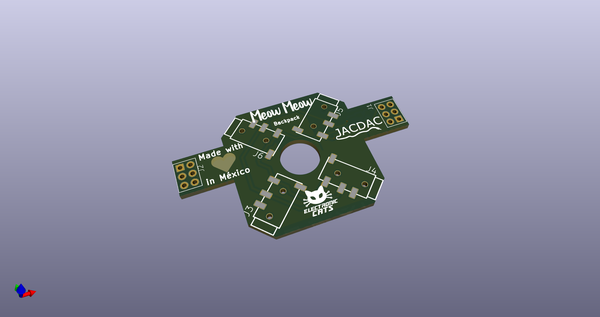
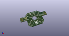
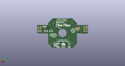
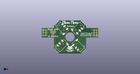

# OOMP Project  
## Backpacks_Meow  by ElectronicCats  
  
(snippet of original readme)  
  
- Backpacks Meow Meow  
  
  
> WARNING: The Backpacks for Meow Meow are very much still under development and subject to change. If you would like to contribute features and ideas, please send pullrequest to this github repository or file an issue.  
  
-- Backpacks  
  
--- JACDAC  
  
The JACDAC Connect system uses the JACDAC (Joint Asynchronous Communications) protocol, a single cable transmission protocol for the plug and play of accessories for microcontrollers.  
  
We have adapted this technology to unlock the following benefits:  
  
- No welding between JACDAC breakouts  
- Connectors with 3.5mm audio plug to avoid connection errors.  
- Ability to create a chain in series where you can connect multiple devices.  
  
More [info about JACDAC](https://jacdac.org/)  
  
--- BLE HID  
Add wireless connection functionality to your Meow Meow thanks to bluetooth 4.0  
  
  
  
-- LICENSE  
  
Hardware released under an CERN Open Hardware Licence v1.2. See the LICENSE_HARDWARE file for more information.  
  
Designed by Electronic Cats.  
  
Electronic Cats is a registered trademark, please do not use if you sell these PCBs.  
  
Electronic Cats invests time and resources providing this open source design, please support Electronic Cats and open-source hardware by purchasing products from Electronic Cats!  
  full source readme at [readme_src.md](readme_src.md)  
  
source repo at: [https://github.com/ElectronicCats/Backpacks_Meow](https://github.com/ElectronicCats/Backpacks_Meow)  
## Board  
  
  
## Schematic  
  
  
  
[schematic pdf](working_schematic.pdf)  
## Images  
  
  
  
  
  
  
