# OOMP Project  
## Badge-BugCON-2022  by ElectronicCats  
  
oomp key: oomp_projects_flat_electroniccats_badge_bugcon_2022  
(snippet of original readme)  
  
- Badge BugCON 2022  
  
  
  
El nuevo orden entrega esta insignia a sus seguidores mas asiduos, escucha nuestras instrucciones, dinos lo que deseas y observa como la seguridad solo es un mito!    
  
-- Como Iniciar  
- Conecta por medio de USB de Badge  
- Utiliza una terminal serial para acceder al badge puedes usar "monitor" en Linux, Putty en Windows  
- Selecciona el puerto serial correcto a 115200 baudios  
- Observa como inicia la terminal  
- Puedes escribir "help" para acceder a mas comandos  
  
-- Deseas programar con Arduino?  
  
Visita la [Wiki del proyecto](https://github.com/ElectronicCats/Badge-BugCON-2022/wiki)  
  
-- Tecnologias utilizadas  
  
- RP2040  
- USB  
- LEDs  
- Microfono  
- Buzzer o bocina  
- Un poco, una cucharadita de Machine Learning, gracias a [EdgeImpulse](https://www.edgeimpulse.com/)  
  
-- Links  
  
- [RP2040 con Arduino Mbed](https://github.com/arduino/ArduinoCore-mbed)  
  
-- Agradecimientos  
¿Quieres dar las gracias? Etiqueta a estas empresas en redes sociales y muestrales tu badge, gracias a ellos es posible  
  
- [BugCON](https://www.pcbway.com/)  
- [ElectronicCats](https://electroniccats.com/)  
  
-- License  
  
Electronic Cats hemos creado un badge electronico para BugCON2022 en la CDMX, bienvenidos a la -badgelive  
  
Electronic Cats invests time and resources providing this open source design, please support Electronic Cats and open-source hardware by purchasing products from Electronic Cats!  
  
Designed by Electronic Cats.  
  
Hardware rel  
  full source readme at [readme_src.md](readme_src.md)  
  
source repo at: [https://github.com/ElectronicCats/Badge-BugCON-2022](https://github.com/ElectronicCats/Badge-BugCON-2022)  
## Board  
  
[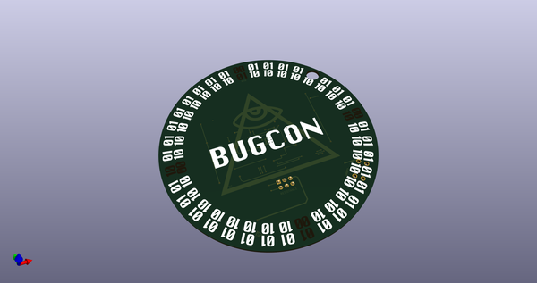](working_3d.png)  
## Schematic  
  
[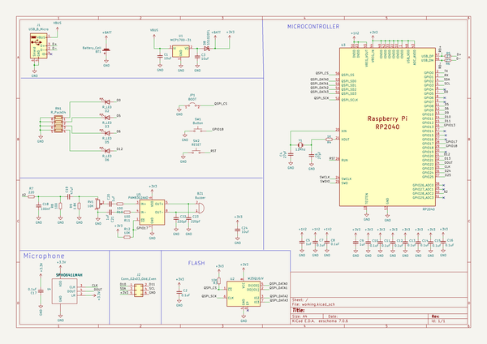](working_schematic.png)  
  
[schematic pdf](working_schematic.pdf)  
## Images  
  
[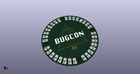](working_3d.png)  
  
[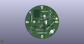](working_3d_back.png)  
  
[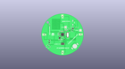](working_3D_bottom.png)  
  
[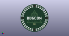](working_3d_front.png)  
  
  
  
[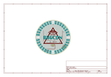](working_assembly_page_01.png)  
  
[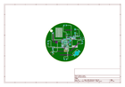](working_assembly_page_02.png)  
  
[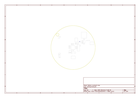](working_assembly_page_03.png)  
  
  
  
[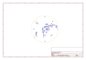](working_assembly_page_05.png)  
  
[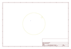](working_assembly_page_06.png)  
