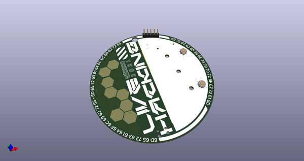
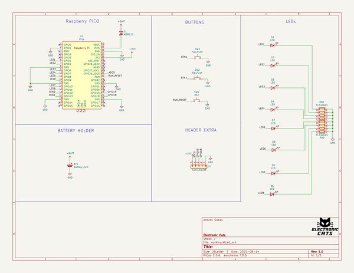
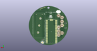

# OOMP Project  
## Badge-LiveHacking2021  by ElectronicCats  
  
oomp key: oomp_projects_flat_electroniccats_badge_livehacking2021  
(snippet of original readme)  
  
- Badge LiveHacking 2021  
  
-- Como Iniciar  
  
1. Conectar Badge via USB a tu computadora.  
2. Abrir el puerto serial indicado para el badge en tucomputadora por medio de algun programa como Arduino IDE, Putty o Screen a 115200 baudios.  
3. En la terminal debera aparecer el texto del badge.  
  
-- Tecnologia  
  
- Raspberry Pico  
- LEDs  
- Button  
- USB  
  
-- Links  
  
- [Raspberry Pico](https://www.raspberrypi.org/products/raspberry-pi-pico/)  
  
-- Agradecimientos  
¿Quieres dar las gracias? Etiqueta a estas empresas en redes sociales y muestrales tu badge, gracias a ellos es posible  
  
- [Mercado Libre](https://www.mercadolibre.com.mx/)  
- [ElectronicCats](https://electroniccats.com/)  
  
-- License  
  
Electronic Cats invests time and resources providing this open source design, please support Electronic Cats and open-source hardware by purchasing products from Electronic Cats!  
  
Designed by Electronic Cats.  
  
Hardware released under an CERN Open Hardware Licence v1.2. See the LICENSE_HARDWARE file for more information.  
  
Electronic Cats is a registered trademark, please do not use if you sell these PCBs.  
  
August 2021  
  
  full source readme at [readme_src.md](readme_src.md)  
  
source repo at: [https://github.com/ElectronicCats/Badge-LiveHacking2021](https://github.com/ElectronicCats/Badge-LiveHacking2021)  
## Board  
  
  
## Schematic  
  
  
  
[schematic pdf](working_schematic.pdf)  
## Images  
  
  
  
  
  
  
