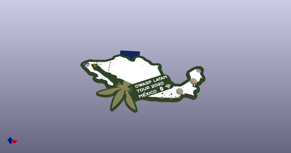
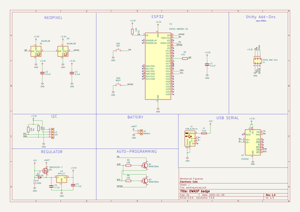
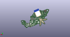

# OOMP Project  
## badge-owasp-latam-mexico-2020  by ElectronicCats  
  
(snippet of original readme)  
  
- Badge OWASP LATAM México 2020  
  
Una vez mas en el año 2020 nos reunimos para celebrar OWASP Latam México 2020, en Electronic Cats hemos creado un badge electronico para todos los asistentes, bienvenidos a la -badgelive  
  
-- Capture The Flag  
  
Unete al reto de Capture The Flag y descubre todo lo que tiene dentro este badge por medio de una herramienta Bluetooth ;)  
  
-- Tecnologia  
  
- ESP32 BLE and WIFI  
- Convetidor USB-Serial  
- LED WS2812B Mini  
- OLED  
  - [Version 1](https://uelectronics.com/producto/display-pantalla-oled-blanco-128x32-0-91-i2c-ssd1306/)  
  - [Version 2](https://articulo.mercadolibre.com.mx/MLM-878713326-display-pantalla-oled-128x32-091-arduino-pic-i2c-lcd-_JM-position=1&search_layout=grid&type=pad&tracking_id=39be533f-0b75-4b89-943c-e1481425476c&is_advertising=true&ad_domain=VQCATCORE_LST&ad_position=1&ad_click_id=NjJlMjUyZGItODc5Zi00ODY1LWIwYTgtNjJlMTVmOGMyMGRm)  
  
-- Links  
  
- [ESP32 con Arduino](https://github.com/espressif/arduino-esp32)  
- [Herramienta para carga de binario CTF](https://github.com/espressif/esptool)  
  
-- Agradecimientos  
¿Quieres dar las gracias? Etiqueta a estas empresas en redes sociales y muestrales tu badge, gracias a ellos es posible  
  
- [PCBWay](https://www.pcbway.com/)  
- [LCSC](https://lcsc.com/)  
- [ESPRESSIF](https://www.espressif.com/)  
  
-- License  
  
Electronic Cats invests time and resources providing this open source design, please support Electronic Cats and open-source hardware by purchasing products from Electronic Cats!  
  
Designed by El  
  full source readme at [readme_src.md](readme_src.md)  
  
source repo at: [https://github.com/ElectronicCats/badge-owasp-latam-mexico-2020](https://github.com/ElectronicCats/badge-owasp-latam-mexico-2020)  
## Board  
  
  
## Schematic  
  
  
  
[schematic pdf](working_schematic.pdf)  
## Images  
  
  
  
  
  
  
