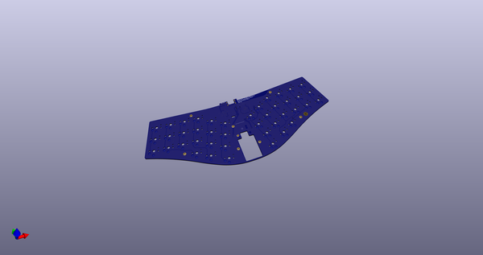
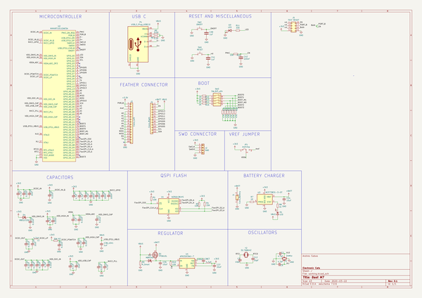
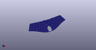
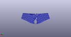
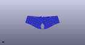

# OOMP Project  
## Bast-M7  by ElectronicCats  
  
oomp key: oomp_projects_flat_electroniccats_bast_m7  
(snippet of original readme)  
  
- Bast M7  
  
License  
Electronic Cats invests time and resources providing this open source design, please support Electronic Cats and open-source hardware by purchasing products from Electronic Cats!  
  
Designed by Electronic Cats.  
  
Firmware released under an GNU AGPL v3.0 license. See the LICENSE file for more information.  
  
Hardware released under an CERN Open Hardware Licence v1.2. See the LICENSE_HARDWARE file for more information.  
  
Electronic Cats is a registered trademark, please do not use if you sell these PCBs.  
  
March 2020  
  
  full source readme at [readme_src.md](readme_src.md)  
  
source repo at: [https://github.com/ElectronicCats/Bast-M7](https://github.com/ElectronicCats/Bast-M7)  
## Board  
  
  
## Schematic  
  
  
  
[schematic pdf](working_schematic.pdf)  
## Images  
  
  
  
  
  
  
