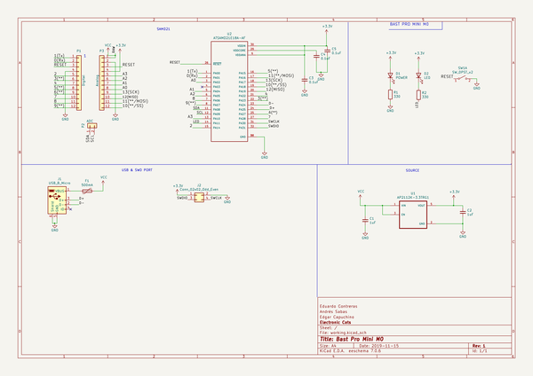
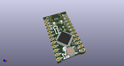
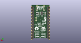
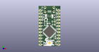

# OOMP Project  
## Bast-Pro-Mini-M0  by ElectronicCats  
  
oomp key: oomp_projects_flat_electroniccats_bast_pro_mini_m0  
(snippet of original readme)  
  
- Bast Pro Mini M0  
  
  
  
**[OSHW] MX0005 | Certified open source hardware |** [oshwa.org/cert.](https://www.oshwa.org/cert)  
  
  
  
Electronic Cats Bast are a complete line of development boards for electronic cats.  
  
  
  
  
Bast Pro Mini M0 is all the best in the world Arduino Pro Mini with a SAMD21 M0+ core, 32 bits of power!, Arduino pro mini pin to pin compatible with a micro USB port.  
  
Electronic Cats invests time and resources providing this open source design, please support Electronic Cats and open-source hardware by purchasing products from Electronic Cats!  
  
Designed by Electronic Cats.  
  
-- Installation  
  
While the SAMD21 alone is powerful enough, what truly makes it special is its growing support in the Arduino IDE. With just a couple click's, copies, and pastes, you can add ARM Cortex-M0+-support to your Arduino IDE.   
  
First of all we'll need to install the Arduino SAMD based boards, to do it you just need to go (Tools > Board > Boards Manager...)  
  
  
  
And then search for "SAMD"  
  
  
  
source repo at: [https://github.com/ElectronicCats/Bast-Pro-Mini-M0](https://github.com/ElectronicCats/Bast-Pro-Mini-M0)  
## Board  
  
  
## Schematic  
  
  
  
[schematic pdf](working_schematic.pdf)  
## Images  
  
  
  
  
  
  
