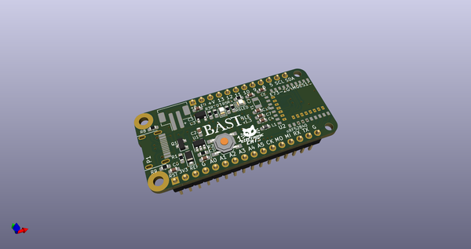
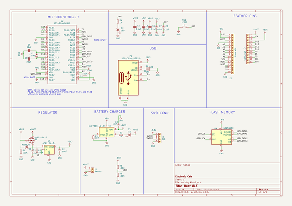
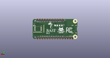
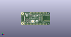

# OOMP Project  
## BastBLE  by ElectronicCats  
  
(snippet of original readme)  
  
- Bast BLE  
  
Bast BLE is all the best in the world format Feather and BLE with a Nordic NRF!, Feather pin to pin compatible with a USB port type C.  
  
Bast-BLE is supported in the Arduino development environment and Circuit Python coming soon  
  
We love all our Feathers equally, but this Feather is very special. It's our first Feather that is specifically designed for use with CircuitPython! CircuitPython is our beginner-oriented flavor of MicroPython - and as the name hints at, its a small but full-featured version of the popular Python programming language specifically for use with circuitry and electronics.  
  
Please note, CircuitPython does not come preloaded. See the full guide linked below for instructions on installing it  
  
Lipoly battery and USB cable not included (but we do have lots of options in the shop if you'd like!)  
  
-- Hardware Features  
  
* Nordic nRF52840 System-on-Chip  
	- ARM® Cortex®-M4F processor optimized for ultra-low power operation  
	- Combining *Bluetooth 5*, *Bluetooth Mesh*, *Thread*, *IEEE 802.15.4*, *ANT* and *2.4GHz proprietary*  
	- On-chip NFC-A tag  
	- On-chip USB 2.0 (Full speed) controller  
	- ARM TrustZone® Cryptocell 310 security subsystem  
	- 1 MB FLASH and 256 kB RAM  
* Program/Debug options with DAPLink  
	- MSC - drag-n-drop programming flash memory  
	- CDC - virtual com port for log, trace and terminal emulation  
	- HID - CMSIS-DAP compliant debug channel  
	- WEBUSB HID - CMSIS-DAP compliant debug channel  
* External ultra-low power 64-Mb QSPI FLASH memory  
  full source readme at [readme_src.md](readme_src.md)  
  
source repo at: [https://github.com/ElectronicCats/BastBLE](https://github.com/ElectronicCats/BastBLE)  
## Board  
  
  
## Schematic  
  
  
  
[schematic pdf](working_schematic.pdf)  
## Images  
  
  
  
  
  
  
