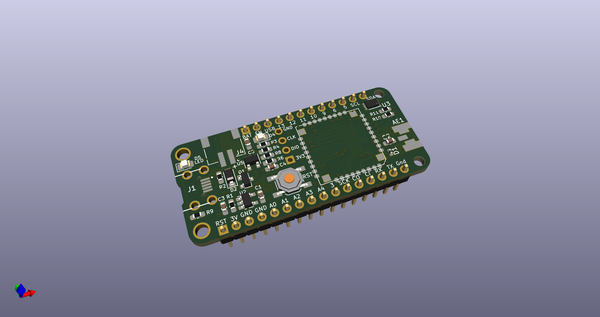
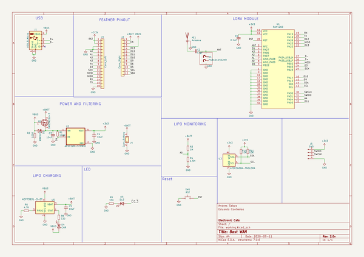

# OOMP Project  
## BastWAN  by ElectronicCats  
  
oomp key: oomp_projects_flat_electroniccats_bastwan  
(snippet of original readme)  
  
- BastWAN  
  
BastWAN is all the best in the world format Feather and LoRa with a RAK4260 core, 32 bits of power!, Feather pin to pin compatible with a micro USB port.  
  
BastWAN is supported in the [Arduino development environment](https://github.com/ElectronicCats/ArduinoCore-samd) and [RIOT OS on BastWan and LowPower](https://github.com/h-filzer/samr34-lorawan-smt50).  
  
We love all our Feathers equally, but this Feather is very special.  
  
That doesn't mean you cant also use it with Arduino IDE! At the Bast's heart is an RAK4260 ARM Cortex M0+ processor, clocked at 48 MHz and at 3.3V logic, the same one used in the new Arduino Zero. This chip has a whopping 256K of FLASH (8x more than the Atmega328 or 32u4) and 32K of RAM (16x as much)! This chip comes with built in USB so it has USB-to-Serial program & debug capability built in with no need for an FTDI-like chip.  
  
Here's some handy specs!  
  
- Light as a (large?) feather - 5 grams  
- RAK4260 @ 48MHz with 3.3V logic/power  
- 256KB of FLASH + 32KB of RAM  
- No EEPROM  
- 32.768 KHz crystal for clock generation & RTC  
- 3.3V regulator with 500mA peak current output  
- USB native support, comes with USB bootloader and serial port debugging  
- You also get tons of pins - 20 GPIO pins  
- Hardware Serial, hardware I2C, hardware SPI support  
- PWM outputs on all pins  
- 6 x 12-bit analog inputs  
- 1 x 10-bit analog ouput (DAC)  
- Built in 100mA lipoly charger with charging status indicator LED  
- Pin -13 red LED for general purpose blinking  
- Power/enab  
  full source readme at [readme_src.md](readme_src.md)  
  
source repo at: [https://github.com/ElectronicCats/BastWAN](https://github.com/ElectronicCats/BastWAN)  
## Board  
  
  
## Schematic  
  
  
  
[schematic pdf](working_schematic.pdf)  
## Images  
  
  
  
  
  
  
  
  
  
  
  
  
  
  
  
  
  
  
  
  
  
  
