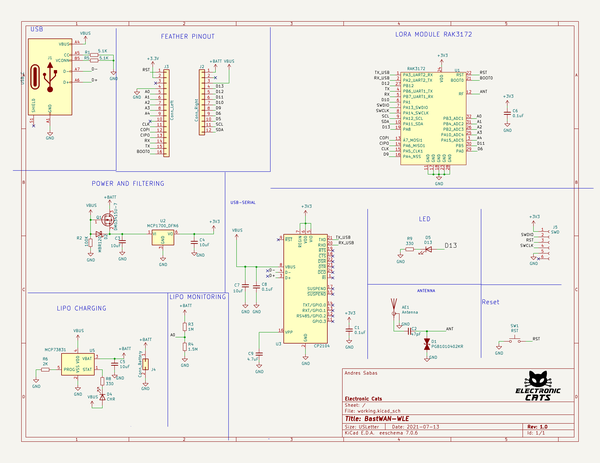

# OOMP Project  
## BastWAN-WLE  by ElectronicCats  
  
(snippet of original readme)  
  
- BastWAN-WLE  
  
BastWAN-WLE is all the best in the world format Feather and LoRa with a RAK3172 core ARM M4, 32 bits of power!, Feather pin to pin compatible with a micro USB port.  
  
We love all our Feathers equally, but this Feather is very special.  
  
That doesn't mean you cant also use it with Arduino IDE! At the Bast's heart is an RAK3172 ARM Cortex M4 processor, clocked at 48 MHz and at 3.3V logic. This chip has a whopping 256K of FLASH (8x more than the Atmega328 or 32u4) and 64K of RAM (32x as much)!.  
  
Here's some handy specs!  
  
- Based on STM32WLE5CCU6  
- LoRaWAN 1.0.3 specification compliant  
- Supported bands: EU433, CN470, IN865, EU868, AU915, US915, KR920, RU864, and AS923  
- LoRaWAN Activation by OTAA/ABP  
- LoRa Point to Point (P2P) communication  
- Long-range - greater than 15 km with optimized antenna  
- Arm Cortex-M4 32-bit  
- 256 kbytes flash memory  
- 64 kbytes RAM  
- Ultra-Low Power Consumption of 1.69 μA in sleep mode  
- Supply Voltage: 2.0 V ~ 3.6 V  
- Temperature Range: -40° C ~ 85° C  
- 3.3V regulator with 500mA peak current output  
- USB native support, comes with USB bootloader and serial port debugging  
- You also get tons of pins - 20 GPIO pins  
- Hardware Serial, hardware I2C, hardware SPI support  
- PWM outputs on all pins  
- 6 x 12-bit analog inputs  
- 1 x 10-bit analog ouput (DAC)  
- Built in 100mA lipoly charger with charging status indicator LED  
- Pin -13 red LED for general purpose blinking  
- Power/enable pin  
- 4 mounting holes  
- Reset button  
- Support Arduino Core  
  full source readme at [readme_src.md](readme_src.md)  
  
source repo at: [https://github.com/ElectronicCats/BastWAN-WLE](https://github.com/ElectronicCats/BastWAN-WLE)  
## Board  
  
  
## Schematic  
  
  
  
[schematic pdf](working_schematic.pdf)  
## Images  
  
  
  
  
  
  
  
  
  
  
  
  
  
  
  
  
  
  
  
  
  
  
