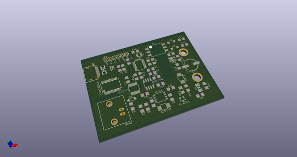
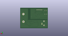
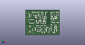

# OOMP Project  
## Battlab-One  by ElectronicCats  
  
(snippet of original readme)  
  
- BattLab-One  
The BattLab-One estimates the battery life of your IOT project using the DUT cutoff voltage, battery state of charge data, event duration, and captured active and sleep event current profiles.  
  
-- Main characteristics   
  
- Captures both active event and sleep mode current  
  
- MSP430 microcontroller based device that simulates standard batteries for Li-Ion, LiFePO4, Alkaline, NiMh, NiCd  
  
- Provides voltages of 1.2V, 1.5V, 2.4V, 3.0V, 3.2, 3.6V, 3.7V, 4.5V at up to 450 mA.  
  
- Trigger input to capture firmware states and their impact on overall battery life  
  
- 1kHz Sample rate, 16 bit delta-sigma ADC  
  
- Long active event capture duration from seconds to hours  
  
- Extremely low burden voltage across all ranges (BattLab-One provides PSU output)  
  
- Provides “what-if” optimization by letting you change your battery, current profiles, active and sleep duration as well as cutoff voltage  
  
- Features the ability to save profiles so you can compare your DUT current profiles  
  
- Interactive/detailed active current plot so you can look for anomalies and identify performance  
  
-- Archives  
  - Battlab-One Quick Start Guide  
  
  - BattLab_One_Production_Rev_A.py - Python Application Code for Production version 1.01  
  
  - Production_Rev_A.sch - Schematic in Kicad  
  
  - Production_Rev_A.kicad_pcb- PCB Layout in Kicad   
  
  - MSP430Firmware.c - Firmware code for the MSP430 for Production Version 1.01  
  
  - BOM_Production_Rev_A - Bill of Materials for Battlab-One Production Rev A  
  
  - 98-bluebi  
  full source readme at [readme_src.md](readme_src.md)  
  
source repo at: [https://github.com/ElectronicCats/Battlab-One](https://github.com/ElectronicCats/Battlab-One)  
## Board  
  
  
## Schematic  
  
  
  
[schematic pdf](working_schematic.pdf)  
## Images  
  
  
  
  
  
  
