# OOMP Project  
## BomberCat  by ElectronicCats  
  
oomp key: oomp_projects_flat_electroniccats_bombercat  
(snippet of original readme)  
  
- BomberCat  
  
  
  
-- How does BomberCat work?  
BomberCat is the latest security tool that combines the most common card technologies: NFC technology (Near Field Communication) and magnetic stripe technology used in access control, identification, and banking cards.  
Specially created to audit banking terminals, and identify NFC readers and sniffing tools, with this tool you can audit, read or emulate magnetic stripes and NFC cards.  
  
It also has an ESP32 co-processor with WiFiNINA firmware that allows it to make WiFi connections to use with HTTP or MQTT protocols, which will allow relay and spoofing attacks to be tested over long distances or on local web servers.  
  
-- Applications  
BomberCat features an RP2040 MCU working along with the PN7150 (a recent generation NFC chip).   
The USB interface provided by the RP2040 MCU and the NFC functionality is guaranteed by the PN7150.  
  
BomberCat is designed to be intuitive for users. Easy to program using frameworks such as Arduino, Ciruitpython, and Micropython.  We have prepared a series of examples with which you can start experimenting, check out the examples folder.  
  
**Card emulation mode:** in which BomberCat behaves as a smart card or a tag. In this mode, BomberCat emulates an NFC tag. It does not initiate communication, it only responds to the NFC reader.   
A typical applicatio  
  full source readme at [readme_src.md](readme_src.md)  
  
source repo at: [https://github.com/ElectronicCats/BomberCat](https://github.com/ElectronicCats/BomberCat)  
## Board  
  
[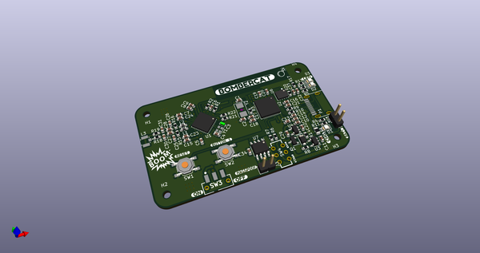](working_3d.png)  
## Schematic  
  
[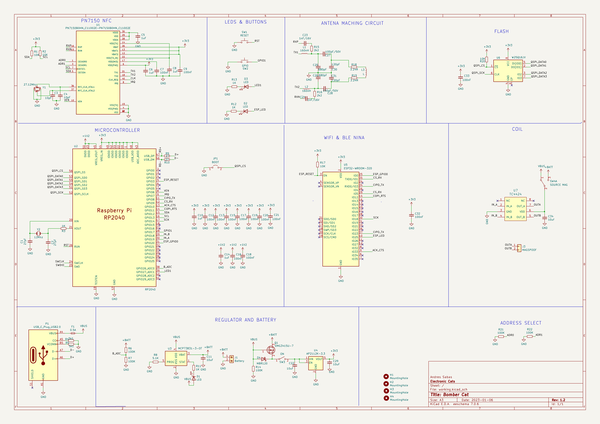](working_schematic.png)  
  
[schematic pdf](working_schematic.pdf)  
## Images  
  
[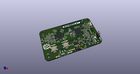](working_3d.png)  
  
[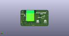](working_3d_back.png)  
  
  
  
[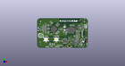](working_3d_front.png)  
  
[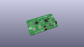](working_3D_top.png)  
  
[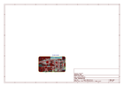](working_assembly_page_01.png)  
  
[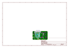](working_assembly_page_02.png)  
  
[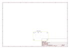](working_assembly_page_03.png)  
  
[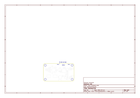](working_assembly_page_04.png)  
  
[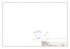](working_assembly_page_05.png)  
  
[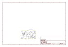](working_assembly_page_06.png)  
