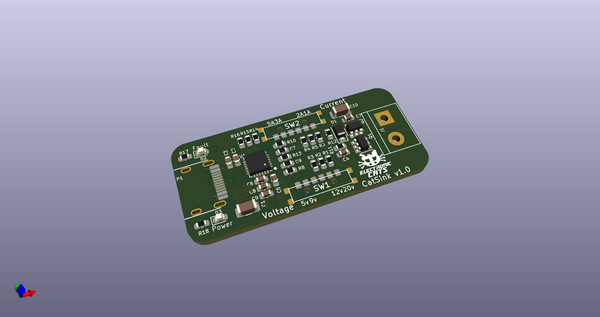
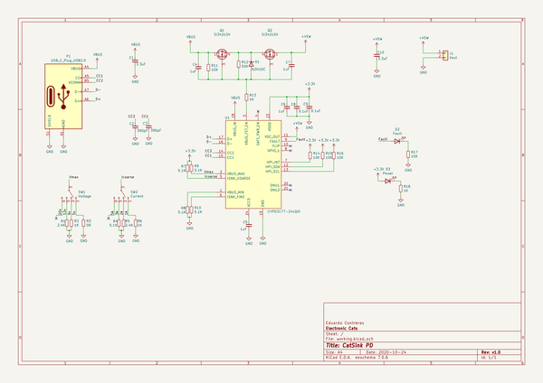
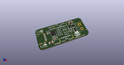
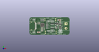
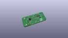
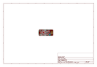
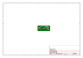
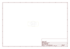
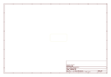
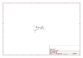

# OOMP Project  
## Cat-Sink  by ElectronicCats  
  
(snippet of original readme)  
  
- CatSink - USB power supply with PD  
  
A USB-C PD Sink up to 20V 5A based on the Cypress CYPD3177 USB PD Controller  
  
USB-C PD offers the option to negotiate power delivery from a compatible power supply. This board plays the role of a sink device, enabling any device to be powered from a USB power supply. Any type of power connector can be attached through a 2-pin screw terminal or directly soldered into the PCB for a lower profile. The voltage can be set to 5V, 9V, 12V, or 20V and maximum negotiable current can be set to 1A, 2A, 3A, or 5A. Other voltage or current settings are possible by changing resistors. No programming needed.  
  
-- Wiki  
[Manual and getting started](https://github.com/ElectronicCats/Cat-Sink/wiki)  
  
  
-- License  
  
  
 Esta obra está bajo una <a rel="license" href="http://creativecommons.org/licenses/by-sa/4.0/">Licencia Creative Commons Atribución-CompartirIgual 4.0 Internacional</a>.  
  
  
  
Electronic Cats invests time and resources providing this open source design, please support Electronic Cats and op  
  full source readme at [readme_src.md](readme_src.md)  
  
source repo at: [https://github.com/ElectronicCats/Cat-Sink](https://github.com/ElectronicCats/Cat-Sink)  
## Board  
  
  
## Schematic  
  
  
  
[schematic pdf](working_schematic.pdf)  
## Images  
  
  
  
  
  
  
  
  
  
  
  
  
  
  
  
  
  
  
  
  
  
  
