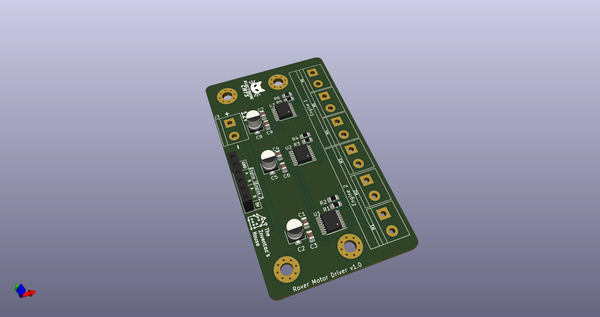
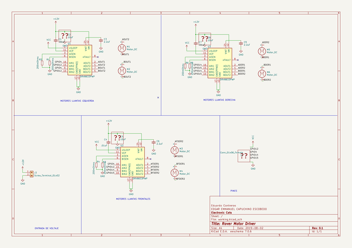
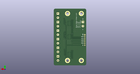
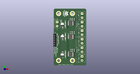

# OOMP Project  
## CatFinder  by ElectronicCats  
  
(snippet of original readme)  
  
- CatFinder  
  
  
The Electronic Cats along with The Inventor's House have developed a new development kit for a Mars Rover in which almost everyone can participate  
  
"The CatFinder" is an exploration vehicle that collects data from the environment in which it travels.  
  
  
  
The CatFinder Rover is cappable of transmit:  
  
- Humidity  
- Atmosphere pressure  
- Temperature   
- CO2 levels in ppm  
- TVOC levels in ppb   
- Position with acelerometer and gyroscope  
- Video broadcasting.  
  
Yes! we're capable of getting data, control the motors and transmitting video, through WiFi thanks to the ESP32-CAM and the [Bast Pro Mini](https://github.com/ElectronicCats/Bast-Pro-Mini-M0) (Which is a devBoard fully compatible with the Arduino Pro Mini).  
  
-- Licence --  
  
Firmware released under an GNU AGPL v3.0 license. See the LICENSE file for more information.  
  
Hardware released under an CERN Open Hardware Licence v1.2. See the LICENSE_HARDWARE file for more information.  
  
Electronic Cats is a registered trademark, please do not use if you sell these PCBs.  
  
Electronic Cats invests time and resources providing this open source design, please support Electronic Cats and open-source hardware by purchasing products from Electronic Cats!  
  
  full source readme at [readme_src.md](readme_src.md)  
  
source repo at: [https://github.com/ElectronicCats/CatFinder](https://github.com/ElectronicCats/CatFinder)  
## Board  
  
  
## Schematic  
  
  
  
[schematic pdf](working_schematic.pdf)  
## Images  
  
  
  
  
  
  
