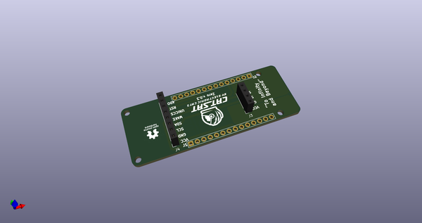
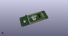
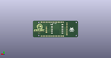
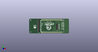

# OOMP Project  
## CatSatZero  by ElectronicCats  
  
oomp key: oomp_projects_flat_electroniccats_catsatzero  
(snippet of original readme)  
  
- CaTSatZero  
  
Kit CatSat Zero Education  
  
Manual and more information in our [Wiki](https://github.com/ElectronicCats/CatSatZero/wiki)  
  
Electronic Cats invests time and resources providing this open source design, please support Electronic Cats and open-source hardware by purchasing products from Electronic Cats!  
  
Designed by Electronic Cats.  
  
  
  
-- License  
  
  
  
Firmware released under an GNU AGPL v3.0 license. See the LICENSE file for more information.  
  
Hardware released under an CERN Open Hardware Licence v1.2. See the LICENSE_HARDWARE file for more information.  
  
Electronic Cats is a registered trademark, please do not use if you sell these PCBs.  
  
15 April 2018  
  
  full source readme at [readme_src.md](readme_src.md)  
  
source repo at: [https://github.com/ElectronicCats/CatSatZero](https://github.com/ElectronicCats/CatSatZero)  
## Board  
  
  
## Schematic  
  
  
  
[schematic pdf](working_schematic.pdf)  
## Images  
  
  
  
  
  
  
