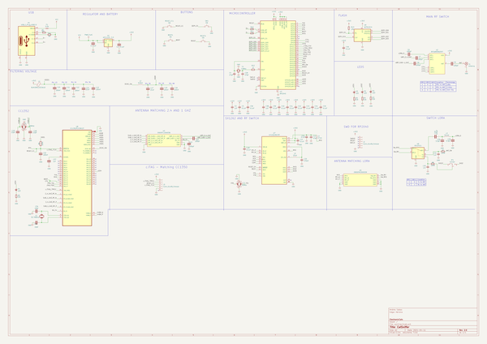

# OOMP Project  
## CatSniffer  by ElectronicCats  
  
oomp key: oomp_projects_flat_electroniccats_catsniffer  
(snippet of original readme)  
  
- CatSniffer  
  
CatSniffer (:smirk_cat:) is an original multiprotocol, and multiband board made for sniffing, communicating, and attacking IoT (Internet of Things) devices. It was designed as a highly portable USB stick that integrates the new chips TI CC1352, Semtech SX1262, Microchip SAMD21E17 V2 or previous and RP2040 V3 or later.  
  
This board is a swiss army knife for IoT security researchers, developers, and enthusiasts. The board can be used with different types of software including third-party sniffers such as [SmartRF Packet Sniffer](https://www.ti.com/tool/PACKET-SNIFFER), [Sniffle](https://github.com/ElectronicCats/Sniffle), [zigbee2mqtt](https://github.com/Koenkk/zigbee2mqtt), [Z-Stack-firmware](https://github.com/Koenkk/Z-Stack-firmware), [Ubiqua Protocol Analyzer](https://www.ubilogix.com/ubiqua/), [our custom firmware](https://github.com/ElectronicCats/CatSniffer/tree/master/firmware), or you can even write your own software for your specific needs.  
  
CatSniffer can operate in 3 different frequencies:  
* LoRa  
* Sub 1 GHz  
* 2.4 GHz  
  
This work was inspired by our friend's work [Michael Ossmann](https://twitter.com/michaelossmann) as a tribute to his outstanding job in [Greatscott Gadgets](https://greatscottgadgets.com/), making devices like the YardStick, GreatFET, HackRF, and Ubertooth.  
  
  
  
-- Protocols  
- Th  
  full source readme at [readme_src.md](readme_src.md)  
  
source repo at: [https://github.com/ElectronicCats/CatSniffer](https://github.com/ElectronicCats/CatSniffer)  
## Board  
  
  
## Schematic  
  
  
  
[schematic pdf](working_schematic.pdf)  
## Images  
  
  
  
  
  
  
  
  
  
  
  
  
  
  
  
  
  
  
  
  
  
  
