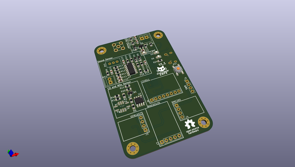
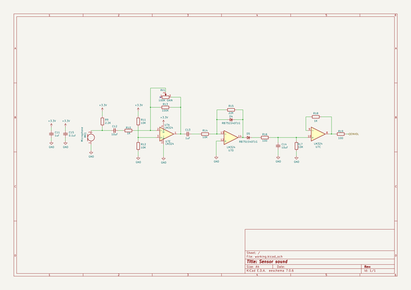
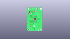
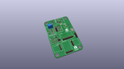
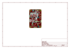
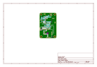
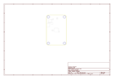
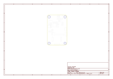
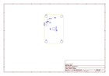
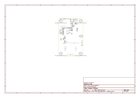

# OOMP Project  
## CatWAN_Citizen  by ElectronicCats  
  
oomp key: oomp_projects_flat_electroniccats_catwan_citizen  
(snippet of original readme)  
  
- CatWAN Citizen Sensor Board  
  
LoRa Smart city sensor, based on open hardware and free software, generating and sharing real open data on air pollution, acoustics and many more, compatible with LoRa and LoRaWAN.  
  
-- Sensor list  
  
  
|Metric|Units|Sensor|  
|-|:-:|:-:|  
| **Atmospheric Pressure** | Pa | BME280 |  
| **Air Temperature / Relative Humidity** | ºC / %rh | BME280|  
| **CO, eCO2** | ppm |AMS CCS811|  
| **Noise Level and Spectrum** | dBa |Microphone|  
| **Ambient Light** | lx | Rohm BEML6075 |  
  
  
-- LICENSE  
Firmware released under an GNU AGPL v3.0 license. See the LICENSE file for more information.  
  
Hardware released under an CERN Open Hardware Licence v1.2. See the LICENSE_HARDWARE file for more information.  
  
Designed by Electronic Cats.  
  
Electronic Cats is a registered trademark, please do not use if you sell these PCBs.  
  
Electronic Cats invests time and resources providing this open source design, please support Electronic Cats and open-source hardware by purchasing products from Electronic Cats!  
  
  full source readme at [readme_src.md](readme_src.md)  
  
source repo at: [https://github.com/ElectronicCats/CatWAN_Citizen](https://github.com/ElectronicCats/CatWAN_Citizen)  
## Board  
  
  
## Schematic  
  
  
  
[schematic pdf](working_schematic.pdf)  
## Images  
  
  
  
  
  
  
  
  
  
  
  
  
  
  
  
  
