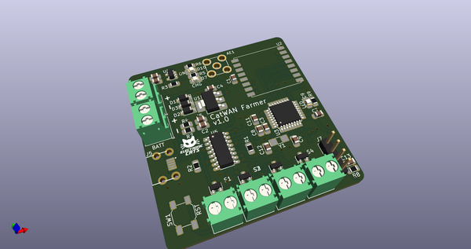

# OOMP Project  
## CatWAN_Farmer  by ElectronicCats  
  
oomp key: oomp_projects_flat_electroniccats_catwan_farmer  
(snippet of original readme)  
  
- CatWAN Farmer by Electronic Cats  
  
CatWAN Farmer, a grower's water saving project  
  
Monitoring soil moisture at different depths to determine when to irrigate, and - more importantly - how much water is needed. Save 25%!  
  
  
-- Main characteristics  
  
- Provide low cost, easy to build, and rugged components for optimizing agricultural irrigation.  
- DIY calibrated gypsum soil moisture sensors (Watermark SS200 is also supported).  
- Hand held sensor reader (soil moisture, soil/water salinity, water pressure).  
- Solar powered remote sensor platform.  
- 4 electrically separated inputs for soil moisture sensors.  
- LoRa module for long range (6 miles).  
- temperature/humidity sensors.  
- Solar battery charger.  
- Real time clock for sleep mode power saving and precise irrigation timing.  
- Gateway to connect multiple LoRa end nodes to the Internet.  
- Supports packet mode LoRa® (package mode) or LoRaWAN ™ Class A, B and C.  
- Compatible with Beelan, The Things Network and other LoRaWAN networks.  
- Easy reprogramming compatible with Arduino and Circuit Python.  
  
-- Specifications  
  
- 32-bit ARM Cortex-M0+ processor with 256KB flash, 32KB SRAM, and an operating speed of up to 48MHz.   
- Connectivity: USB 2.1.  
- Vin: 4.2V-6.0V for charger - otherwise 3.5V-6.0V  
- VBATT: 3.7V Lipo  
- VCC: 600mA @3.3V  
- Receiver Sensitivity: down to -146 dBm.  
- TX Power: adjustable up to +18.5 dBm.  
- Range: up to 15 km coverage in suburban and up to 5 km coverage.  
- Watermark SS200 soil water tension sensor (4 x).  
- Cap  
  full source readme at [readme_src.md](readme_src.md)  
  
source repo at: [https://github.com/ElectronicCats/CatWAN_Farmer](https://github.com/ElectronicCats/CatWAN_Farmer)  
## Board  
  
  
## Schematic  
  
  
  
[schematic pdf](working_schematic.pdf)  
## Images  
  
  
  
  
  
  
