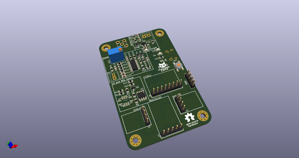
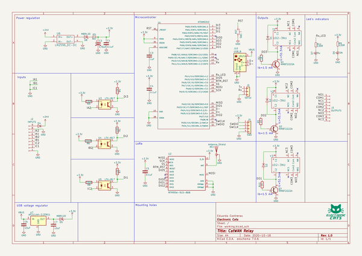

# OOMP Project  
## CatWAN_Relay  by ElectronicCats  
  
oomp key: oomp_projects_flat_electroniccats_catwan_relay  
(snippet of original readme)  
  
- CatWAN Relay  
  
  
  
  
Are you interested in applying LoRa in an industrial environment or even connect a CNC or a PLC as well to a LoRaWAN network?   
  
This board allows you to communicate with every LoRa device which works in the 915 Mhz band.  
  
In this board you will find 3 relays outputs and 3 opto-isolated inputs, and it can be powered from 12v to 24v with a on/off jumper.  
  
By now the provided firmware works as an invisible way to connect two wireless relays based on interrupts, this board its compatible with the [Arduino LoRa library](https://github.com/sandeepmistry/arduino-LoRa) from @sandeepmistry but it can work with the [Radio Head library](https://www.airspayce.com/mikem/arduino/RadioHead/) this using only the LoRa radio if you want to use LoRaWAN you should use the [Arduino LMIC](https://github.com/matthijskooijman/arduino-lmic/tree/non-avr-printf).  
  
This device can work in networks LoRaWAN compatible with classes A, B and C, although we currently do not have a firmware for this way of working. The CatWAN Relay firmware is completely open source and you can find it in our repository along with the schematic. If you want to reprogram this device you can do it through Arduino IDE and its USB port or if you do not have to use a J-Link. ATMEL-ICE or a DIY SWD programmer  
  
This device has a SAMD21 ARM Cortex microcontro  
  full source readme at [readme_src.md](readme_src.md)  
  
source repo at: [https://github.com/ElectronicCats/CatWAN_Relay](https://github.com/ElectronicCats/CatWAN_Relay)  
## Board  
  
  
## Schematic  
  
  
  
[schematic pdf](working_schematic.pdf)  
## Images  
  
  
  
  
  
  
  
  
  
  
  
  
  
  
  
  
  
  
  
  
  
  
