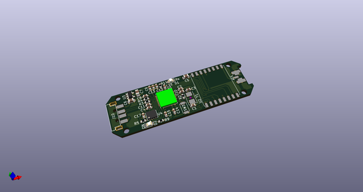
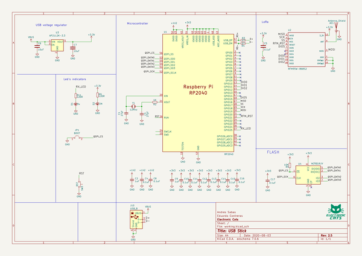
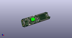
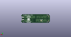
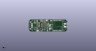
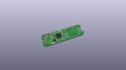
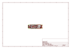
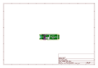
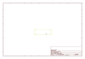
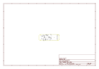

# OOMP Project  
## CatWAN_USB_Stick  by ElectronicCats  
  
oomp key: oomp_projects_flat_electroniccats_catwan_usb_stick  
(snippet of original readme)  
  
- LoRA USB Stick  
  
  
  
**[OSHW] MX000006 | Certified open source hardware |** [oshwa.org/cert.](https://www.oshwa.org/cert)  
  
  
  
Are you interested in learning how LoRa works at the package level? Debugging your own LoRa hardware and trying to detect where something is wrong? Or maybe you're writing a custom application for your Internet of Things (IoT) network with LoraWAN? We have the perfect tool for you!  
  
This CatWAN USB Stick is programmed with a special firmware image that makes it an easy-to-use LoRa sniffer. You can passively capture the data exchanges between two LoRa devices, capturing with our "LoRa Sniffer" the open source network analysis tool that we have created to use together.  
  
This device can work in networks LoRaWAN compatible with classes A, B and C, although currently we do not have a firmware for this way of working, the CatWAN firmware is completely open source and you can find it in our repository along with the schematic. If you want to reprogram this device you can do it through Arduino IDE and its USB port or if you do not have to use a J-Link. ATMEL-ICE or a DIY SWD programmer  
  
This device has a SAMD21 ARM Cortex microcontroller at 48Mhz with native USB 2.1, with 256Kb for programming, compatible with Arduino and Ci  
  full source readme at [readme_src.md](readme_src.md)  
  
source repo at: [https://github.com/ElectronicCats/CatWAN_USB_Stick](https://github.com/ElectronicCats/CatWAN_USB_Stick)  
## Board  
  
  
## Schematic  
  
  
  
[schematic pdf](working_schematic.pdf)  
## Images  
  
  
  
  
  
  
  
  
  
  
  
  
  
  
  
  
  
  
  
  
  
  
