# OOMP Project  
## CatWANShield  by ElectronicCats  
  
oomp key: oomp_projects_flat_electroniccats_catwanshield  
(snippet of original readme)  
  
- LoraShield  
  
  
  
This repository contains the KiCad files for an LoRa shield for arduino uno and some examples that may help you to get running your LoRa based applications with the power of an Arduino UNO   
  
- The folder named "LoRA_PHY_RH" refer to the communication  
P2P by the Physical layer of LoRa,in here you can find 2 examples one as the Transmitter (Which also  is capable of receive information) and the second as the receiver (Which also is capable of transmit e information), both examples work with the [RadioHead](http://www.airspayce.com/mikem/arduino/RadioHead/) library    
  
- The folder named "LoRA_PHY" refer to the communication  
P2P by the Physical layer of LoRa,in here you can find 2 examples one as the Transmitter and the second as the receiver, both examples work with the Official [LoRa](https://github.com/sandeepmistry/arduino-LoRa) library from arduino.  
  
- The folder named LoRa_WAN refer to the communication by a LoRaWAN network from your device to internet, by the two methods that exist OTAA and ABP, both examples were created to read an GPS or/and temperature from one analogic sensor attached to the analog input.  
  
Electronic Cats invests time and resources providing this open source desig  
  full source readme at [readme_src.md](readme_src.md)  
  
source repo at: [https://github.com/ElectronicCats/CatWANShield](https://github.com/ElectronicCats/CatWANShield)  
## Board  
  
[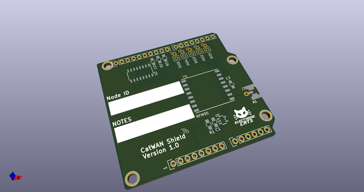](working_3d.png)  
## Schematic  
  
[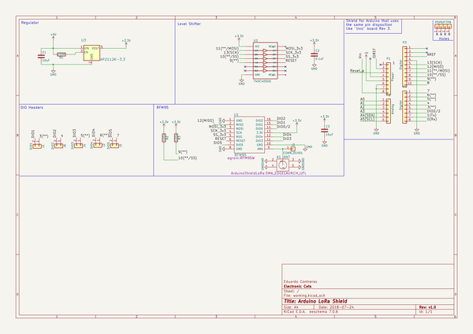](working_schematic.png)  
  
[schematic pdf](working_schematic.pdf)  
## Images  
  
[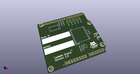](working_3d.png)  
  
[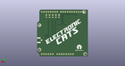](working_3d_back.png)  
  
[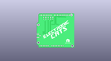](working_3D_bottom.png)  
  
[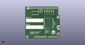](working_3d_front.png)  
  
[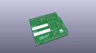](working_3D_top.png)  
  
[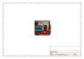](working_assembly_page_01.png)  
  
[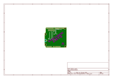](working_assembly_page_02.png)  
  
[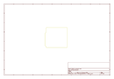](working_assembly_page_03.png)  
  
[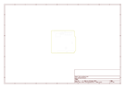](working_assembly_page_04.png)  
  
  
  
[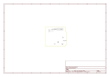](working_assembly_page_06.png)  
