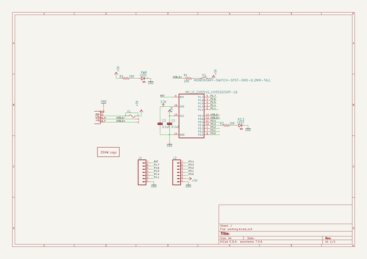

# OOMP Project  
## ch55xduino  by ElectronicCats  
  
(snippet of original readme)  
  
- Ch55xduino: Small Devices Arduino for ch55x devices  
  
-- Arduino core for the CH55x Family  
  
This project brings support for the CH55X chip to the Arduino environment. It lets you write sketches, using familiar Arduino functions and libraries, and run them directly on CH55X, with no external microcontroller required.  
  
Based in the work of [CH55xduino](https://github.com/DeqingSun/ch55xduino)  
  
-- Contents  
- [Installation Instructions](-installation-instructions)  
  
  
--- Installation Instructions  
- Using Arduino IDE Boards Manager (preferred)  
  + [Instructions for Boards Manager](docs/arduino-ide/boards_manager.md)  
- Using Arduino IDE with the development repository  
  + [Instructions for Windows](docs/arduino-ide/windows.md)  
  + [Instructions for Mac](docs/arduino-ide/mac.md)  
  + [Instructions for Debian/Ubuntu Linux](docs/arduino-ide/debian_ubuntu.md)  
  + [Instructions for Fedora](docs/arduino-ide/fedora.md)  
  + [Instructions for openSUSE](docs/arduino-ide/opensuse.md)  
    
  
**Getting started on the Ch55x the easy way. Forked from Sduino project, also based on   
ch554_sdcc project**  
  
Ch55xduino is an Arduino-like programming API for the CH55X, a family of low-cost MCS51 USB MCU. The project tries to remove the difficulty of setting up a compiling environment. Users can simply write code in Arduino IDE and hit one button to flash the chip to get code running. No configuration or guesswork needed.   
  
CH551, CH552, CH554, may be the lowest part count system that works with Arduino. The  
  full source readme at [readme_src.md](readme_src.md)  
  
source repo at: [https://github.com/ElectronicCats/ch55xduino](https://github.com/ElectronicCats/ch55xduino)  
## Board  
  
  
## Schematic  
  
  
  
[schematic pdf](working_schematic.pdf)  
## Images  
