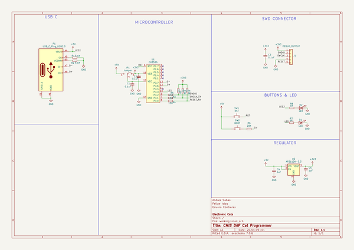
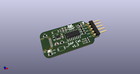
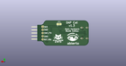
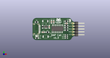
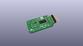
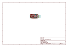
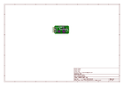
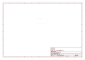
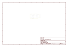
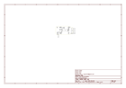

# OOMP Project  
## DAP-Cat-Programmer  by ElectronicCats  
  
(snippet of original readme)  
  
- CMSIS-DAP Cat Programmer  
  
  
  
An Open-Source CMSIS-DAP Debug Probe based on DAPLink  
  
-- Description  
DAP Cat Programmer is a low-cost of $3 dollars debug probe based on the CMSIS-DAP (also known as DAPLink) protocol standard and USB-Serial convert and it can realize USB convert to serial interface. It can be used to program and debug the application software running on Arm Cortex Microcontrollers.  
  
The probe comes with indicator LEDs, a button to reset the target or trigger the firmware update, reversible USB-C connector and easy-to-use 10-pin 2.54mm Header.  
  
-- Features  
- CH552G microcontroller  
- 16KB Flash, 1KB xRAM & 256B iRAM;  
- ROM-based USB drivers. Flash updates via USB supported.  
- Shipped with Arm Mbed DAPLink Firmware  
- HID - CMSIS-DAP compliant debug channel  
- USB Serial bus convert and it can realize USB convert to serial interface.  
- Supported Arduino IDE and OpenOCD  
- LED indicator & Button  
- 3.3V DC-DC regulator with 1A output current  
- 3.3V Digital I/O Operating Voltage  
- Reversible USB-C Connector  
- Easy-to-use 5-pin 2.54mm Header with SWD & UART interface  
- Very small form factor: 20 x 48 mm  
  
  
  
  
-- Wiki and Getting Started  
[Getting Started in our Wiki](https://github.com/ElectronicCat  
  full source readme at [readme_src.md](readme_src.md)  
  
source repo at: [https://github.com/ElectronicCats/DAP-Cat-Programmer](https://github.com/ElectronicCats/DAP-Cat-Programmer)  
## Board  
  
  
## Schematic  
  
  
  
[schematic pdf](working_schematic.pdf)  
## Images  
  
  
  
  
  
  
  
  
  
  
  
  
  
  
  
  
  
  
  
  
  
  
