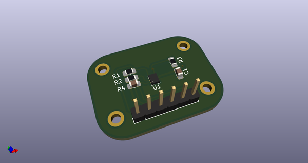
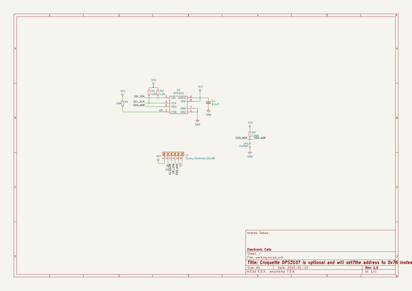
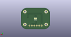
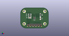
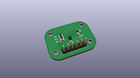
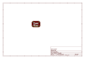
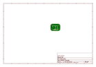
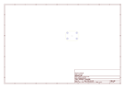
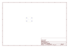
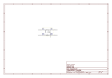

# OOMP Project  
## DPS310-Croquette  by ElectronicCats  
  
(snippet of original readme)  
  
- ElectronicCats Croquette DPS310  
  
-- Summary  
  
The [DPS310](https://www.infineon.com/dgdl/Infineon-DPS310-DS-v01_00-EN.pdf?fileId=5546d462576f34750157750826c42242) is a miniaturized digital barometric air pressure sensor with a high accuracy and a low current consumption, capable of measuring both pressure and temperature. The internal signal processor converts the output from the pressure and temperature sensor elements to 24 bit results. Each unit is individually calibrated, the calibration coefficients calculated during this process are stored in the calibration registers. The available raw data of the sensor can be calibrated by using the pre-calibrated coefficients as they are used in the application to convert the measurement results to high accuracy pressure and temperature values.  
  
Sensor measurements and calibration coefficients are available through the serial I2C or SPI interface.  
  
-- Key Features and Applications  
* Supply voltage range 1.7V to 3.6V  
* Operation range 300hPa – 1200hPa  
* Sensor’s precision 0.005hPa  
* Relative accuracy ±0.06hPa  
* Pressure temperature sensitivity of 0.5Pa/K  
* Temperature accuracy  ±0.5C°  
* Applications  
  * Wearable applications, sport and fitness activities tracking  
  * Drones automatic pilot, fix point flying  
  * Indoor navigation, altitude metering  
  
-- Known Issues  
  
--- Temperature Measurement Issue  
There could be a problem with temperature measurement of the DPS310. If your DPS310 indicates a temperature around 60 °C although you ex  
  full source readme at [readme_src.md](readme_src.md)  
  
source repo at: [https://github.com/ElectronicCats/DPS310-Croquette](https://github.com/ElectronicCats/DPS310-Croquette)  
## Board  
  
  
## Schematic  
  
  
  
[schematic pdf](working_schematic.pdf)  
## Images  
  
  
  
  
  
  
  
  
  
  
  
  
  
  
  
  
  
  
  
  
  
  
