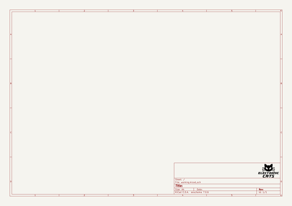

# OOMP Project  
## ElectronicCats-KiCad-Libraries  by ElectronicCats  
  
oomp key: oomp_projects_flat_electroniccats_electroniccats_kicad_libraries  
(snippet of original readme)  
  
  
  
Electronic Cats KiCad Libraries  
====================================  
  
This repository contains a set of KiCad libraries that match the ElectronicCats-Libraries repository, as well as tools that can be used to manipulate various aspects of KiCad libraries and footprints.  
  
**Electronic Cats DFM specifics**  
  
The 'standard' libraries contain internal part numbers for ease of design. Some tools also exist, like the BOM generator, which are only useful with the internal part numbers.  
  
*Note: By setting the field layer to white, the numbers become invisible*  
  
Contents  
-------------------  
  
* [/Documentation](https://github.com/ElectronicCats/ElectronicCats-KiCad-Libraries/tree/master/Documentation) -- Contains documentation written during creation of this repository, with readme.md index of its own!  
* [/Footprints](https://github.com/ElectronicCats/ElectronicCats-KiCad-Libraries/tree/master/Footprints) -- Standard SparkFun KiCad footprints, generated from our Eagle libraries  
* [/Libraries](https://github.com/ElectronicCats/ElectronicCats-KiCad-Libraries/tree/master/Libraries) -- Standard SparkFun KiCad libraries, generated from our Eagle libraries  
* [/Tools](https://github.com/ElectronicCats/ElectronicCats-KiCad-Libraries/tree/master/Tools) -- Tools for converting this and that  
  
  
Versions  
-------  
  full source readme at [readme_src.md](readme_src.md)  
  
source repo at: [https://github.com/ElectronicCats/ElectronicCats-KiCad-Libraries](https://github.com/ElectronicCats/ElectronicCats-KiCad-Libraries)  
## Board  
  
  
## Schematic  
  
  
  
[schematic pdf](working_schematic.pdf)  
## Images  
  
  
  
  
  
  
