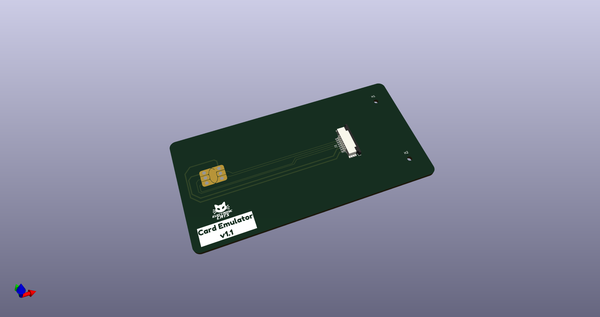
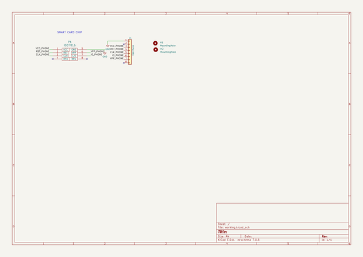
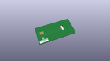
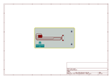
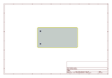
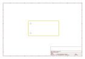
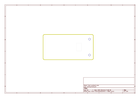
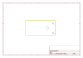

# OOMP Project  
## EMVTracer  by ElectronicCats  
  
oomp key: oomp_projects_flat_electroniccats_emvtracer  
(snippet of original readme)  
  
- EMVTracer  
  
<a href="https://electroniccats.com/store/emv-trace/">  

  
  

  
</a>   
  
-- How does EMVTracer work?  
The EMVTracer tool enables the creation of a connection between an EMV card and a payment terminal. It allows us to connect a computer in between to perform traffic analysis via the USB-C port using the APDU protocol.  
  
-- Understanding the EMVTracer  
  
EMVTracer is based on the SIMtrace 2 project.  
  
The EMVTracer eliminates the need for a computer to analyze information, as analysts can read, modify, or inject commands and responses in real time using its Wi-Fi communication capability. Its ESP32 module enables the transmission and reception of data from cards or terminals through MQTT, facilitating their processing on a server and the retrieval of results. The EMVTracer offers multiple modes, including traffic sniffing between EMV cards and terminals, as well as the ability to emulate EMV transactions, simplifying response analysis and automation.  
  
Additionally, EMVTracer is compatible with [Osmocom SIMtrace 2](https://osmocom.org/projects/simtrace2/wiki), a software, firmware, and hardware system for passively tracing SIM-ME communication between SIM cards, mobile phones, and remote SIM operations. While it was designed for SIM-ME communication, it supports all ISO 7816 smart cards using the T=0 protocol (the most common case).  
  
-- Wiki and Getting Started  
For more   
  full source readme at [readme_src.md](readme_src.md)  
  
source repo at: [https://github.com/ElectronicCats/EMVTracer](https://github.com/ElectronicCats/EMVTracer)  
## Board  
  
  
## Schematic  
  
  
  
[schematic pdf](working_schematic.pdf)  
## Images  
  
  
  
  
  
  
  
  
  
  
  
  
  
  
  
  
  
  
  
  
  
  
