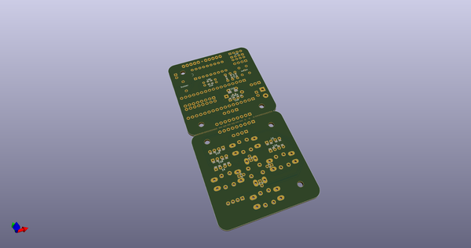
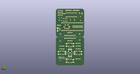
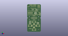

# OOMP Project  
## Escornabot-Makech  by ElectronicCats  
  
(snippet of original readme)  
  
  
  
View this project on [CADLAB.io](https://cadlab.io/project/1721).   
  
- Escornabot Makech  
  
  
  
  
  
**[OSHW] MX000009 | Certified open source hardware |** [oshwa.org/cert.](https://www.oshwa.org/cert)  
  
Escornabot es un proyecto de código/hardware abierto cuyo objetivo es acercar la robótica y la programación a los niños y niñas.  
  
El Escornabot básico puede programarse con los botones para ejecutar secuencias de movimientos. A partir de aquí, la imaginación es el único límite en las posibilidades.  
  
-- Makech  
Diseño de robot basado en el Escornabot Ogaki, creado con el microcontrolador SAMD21 Cortex M0 de 32 bits completamente hecho en KiCAD, especialmente creado para enseñar programación con Arduino, MakeCode y CircuitPython.  
  
Al tener todos los circuitos integrados, elimina la necesidad de cablear, minimizando los errores de electrónica, lo que conlleva un incremento en el tiempo dedicado a programación y al conocimiento de nuevos lenguajes de programación.  
  
Con amor para todo el mundo desde Aguascalientes - México.  
  
- Consigue tu kit, visita: [https://electroniccats.com](https://electroniccats.com)  
  
-- Ogaki  
  
Diseño de robot basado en el Escornabot, completamente hec  
  full source readme at [readme_src.md](readme_src.md)  
  
source repo at: [https://github.com/ElectronicCats/Escornabot-Makech](https://github.com/ElectronicCats/Escornabot-Makech)  
## Board  
  
  
## Schematic  
  
  
  
[schematic pdf](working_schematic.pdf)  
## Images  
  
  
  
  
  
  
