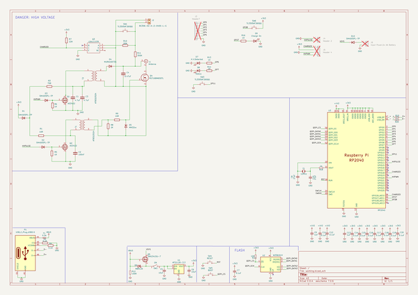
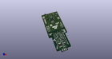
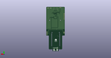
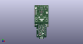
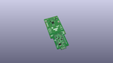
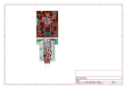
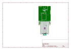
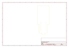
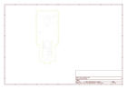
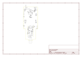

# OOMP Project  
## faultycat  by ElectronicCats  
  
oomp key: oomp_projects_flat_electroniccats_faultycat  
(snippet of original readme)  
  
- Faulty Cat  
  
Faulty Cat is a low-cost Electromagnetic Fault Injection (EMFI) tool, designed specifically for self-study and hobbiest research.  
  
<a href="https://electroniccats.com/store/faulty-cat/">  
  
  
    
  
  
</a>  
  
This Faulty Cat project is *not* the ChipSHOUTER. Instead, it's designed to present a "bare bones" tool that has a design optimization focused in rough order of (1) safe operation, (2) cost, (3) usability, (4) performance. Despite the focus on safety and low cost, it works *surprisingly* well. It is also *not* sold as a complete product - you are responsible for building it, ensuring it meets any relevant safety requirements/certifications, and we completely disclaim all liability for what happens next. Please **only** use Faulty Cat where you are building and controlling it yourself, with total understanding of the operation and risks. It is *not* designed to be used in professional or educational environments, where tools are expected to meet safety certifications (ChipSHOUTER was designed for these use-cases).  
  
**IMPORTANT**: The plastic shield is critical for safe operation. While the output itself is isolated from the input connections, you will still **easily shock yourself** on the exposed high-voltage capacitor and circuitry. **NEVER** operate the device without the shield.  
  
As an open-source project, it also collects inputs from various community  
  full source readme at [readme_src.md](readme_src.md)  
  
source repo at: [https://github.com/ElectronicCats/faultycat](https://github.com/ElectronicCats/faultycat)  
## Board  
  
  
## Schematic  
  
  
  
[schematic pdf](working_schematic.pdf)  
## Images  
  
  
  
  
  
  
  
  
  
  
  
  
  
  
  
  
  
  
  
  
  
  
