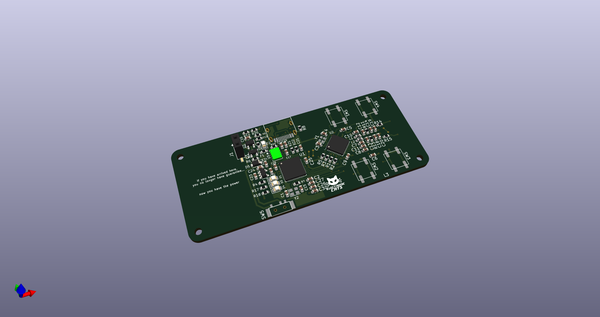
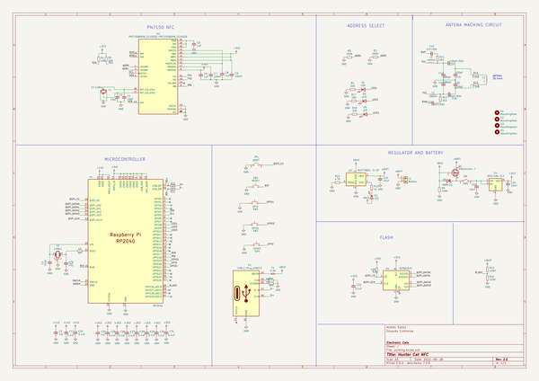

# OOMP Project  
## HunterCatNFC  by ElectronicCats  
  
oomp key: oomp_projects_flat_electroniccats_huntercatnfc  
(snippet of original readme)  
  
- Hunter Cat NFC  
  
<a href="https://electroniccats.com/store/hunter-cat-nfc/">  
  
  
    
  
  
</a>  
  
-- How does the Hunter Cat NFC work?  
  
The Hunter Cat NFC is a security tool for contactless (Near Field Communication) used in access control, identification, and bank cards. It is specially created to identify NFC readers and sniffing tools. With this tool, you can audit, read or emulate cards of different types.  
  
-- Understanding the Hunter Cat NFC and its LEDs   
  
The device has preloaded reader detection firmware that lets the user know when is near an NFC reader attempting to read his card.  
  
--- Reader detection   
  
To detect hidden readers seeking to read your cards without authorization for cloning.  
  
1. Turn on Hunter Cat NFC  
2. Wait for the LEDs to turn off  
3. Red LED flashes every 1 second  
4. Approach the reader, the Hunter Cat NFC LEDs should light up indicating if an NFC reader was detected  
5. If it does not turn on and the LED stays on, it is not near an NFC reader  
  
-- How does it work?   
  
Hunter Cat NFC can be set to behave either as an NFC reader, a tag, or to establish a two-way connection with another NFC device.  
  
NFC USB Dongle features a SAMD21 MCU which works in conjunction with the PN7150. The USB interface is provided by SAMD21 MCU, and the NFC functionality is ensured thanks to PN7150.  
  
NFC is designed to be intuitive for users. The communication between two   
  full source readme at [readme_src.md](readme_src.md)  
  
source repo at: [https://github.com/ElectronicCats/HunterCatNFC](https://github.com/ElectronicCats/HunterCatNFC)  
## Board  
  
  
## Schematic  
  
  
  
[schematic pdf](working_schematic.pdf)  
## Images  
  
  
  
  
  
  
  
  
  
  
  
  
  
  
  
  
  
  
  
  
  
  
