# OOMP Project  
## magspoof  by ElectronicCats  
  
oomp key: oomp_projects_flat_electroniccats_magspoof  
(snippet of original readme)  
  
  
- MagSpoof Electronic Cats - Credit Card/Magstripe Spoofer  
  
<a href="https://electroniccats.com/store/magspoof-v4/">  
  
  
    
  
  
</a>  
  
- How does MagSpoof work?  
  
**MagSpoof Electronic Cats** is a device that can spoof/emulate any magnetic stripe or credit card. It can work "wirelessly", even on **standard magstripe/credit card readers**, by generating a strong electromagnetic field that emulates a traditional magnetic stripe card.  
  
* Allows you to store all of your credit cards and magstripes in one device  
* Works on traditional magstripe readers **wirelessly** (no NFC/RFID required)  
* Can **disable** Chip-and-PIN (code not included)  
* Correctly **predicts** Amex credit card numbers + expirations from previous card number (code not included)  
* Supports all three magnetic stripe tracks, and even supports Track 1+2 simultaneously  
* Easy to build using Arduino or other common parts  
  
MagSpoof can be used as a traditional credit card and simply store all of your credit cards (and with modification, can technically disable chip requirements) in various impressive and exciting form factors, or can be used for security research in any area that would traditionally require a magstripe, such as readers for credit cards, drivers licenses, hotel room keys, automated parking lot tickets, etc.  
  
**Note**: The Chip-and-PIN and Amex information is **not** implemented and using MagSpoof   
  full source readme at [readme_src.md](readme_src.md)  
  
source repo at: [https://github.com/ElectronicCats/magspoof](https://github.com/ElectronicCats/magspoof)  
## Board  
  
  
## Schematic  
  
[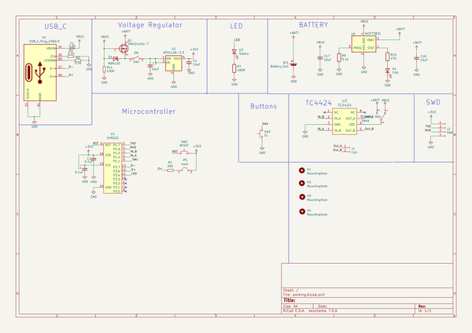](working_schematic.png)  
  
[schematic pdf](working_schematic.pdf)  
## Images  
  
[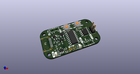](working_3d.png)  
  
[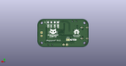](working_3d_back.png)  
  
  
  
[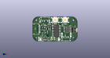](working_3d_front.png)  
  
[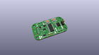](working_3D_top.png)  
  
[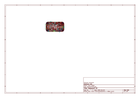](working_assembly_page_01.png)  
  
[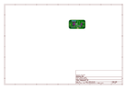](working_assembly_page_02.png)  
  
[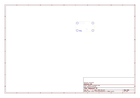](working_assembly_page_03.png)  
  
[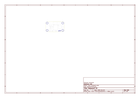](working_assembly_page_04.png)  
  
[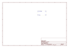](working_assembly_page_05.png)  
  
[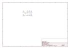](working_assembly_page_06.png)  
